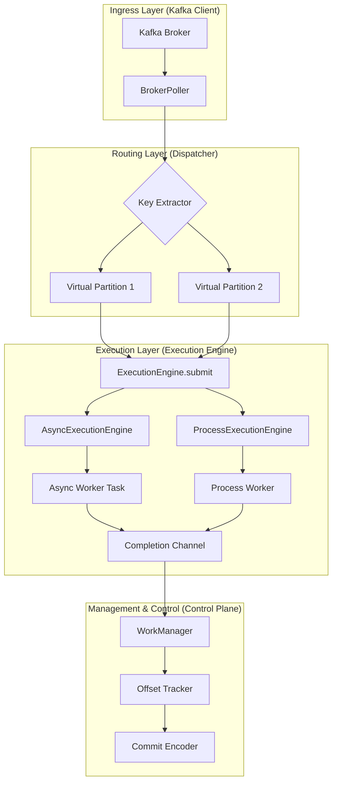

[English](./README.md) | [한국어](./README.ko.md)

# Pyrallel Consumer

## 고성능 Kafka 병렬 처리 라이브러리


## 🔎 Search Keywords

- Python Kafka parallel consumer
- parallel consumer for Kafka in Python
- key-ordered Kafka processing

`Pyrallel Consumer`는 **Python Kafka 병렬 컨슈머(Parallel Consumer)**로, 고처리량 스트림 처리에 최적화된 라이브러리입니다.
즉, **Python에서 Kafka 병렬 컨슈머를 찾는 경우**를 대상으로 하며, **키 기준 순서 보장(key-ordered processing)**, 안정적인 오프셋 커밋, 런타임 선택형 실행 엔진(`asyncio`/multiprocessing)을 제공합니다.

Java 생태계의 `confluentinc/parallel-consumer`에서 영감을 받아, 병렬성을 극대화하면서도 데이터 정합성과 순서 보장을 유지하도록 설계되었습니다.

> **릴리즈 정책:** 현재 배포 버전은 stable(`1.0.0`)입니다. `main` 브랜치는 stable 릴리즈 브랜치이며, prerelease 라인은 opt-in preview 채널로 운영됩니다.

## 지원 / 호환성 정책

- **Python:** 현재 패키지 메타데이터 기준 지원 대상은 `>=3.12`이며, 배포 classifier는 Python `3.12`, `3.13`을 명시합니다.
- **Kafka:** 현재 자동화된 호환성 baseline은 `confluentinc/cp-kafka:7.6.0` 위에서 문서화된 Python/client lane을 broker-backed 검증으로 확인합니다. 그 외 브로커 배포판이나 더 오래된 client/broker 조합은 best-effort이며, 자세한 표는 [`docs/operations/compatibility-matrix.md`](./docs/operations/compatibility-matrix.md)를 참고하세요.
- **릴리즈 라인 지원:** 최신 stable minor를 active support 대상으로, 직전 stable minor를 security-fix-only 대상으로 운영하며, prerelease 라인은 best-effort입니다.
- **정책 상세:** [`docs/operations/support-policy.md`](./docs/operations/support-policy.md)를 참고하세요.
- **보안 제보 경로:** [`SECURITY.md`](./SECURITY.md)를 참고하세요.
- **Public contract freeze:** [`docs/operations/public-contract-v1.md`](./docs/operations/public-contract-v1.md)에서 stable v1 기준의 ordering / rebalance / DLQ / commit contract surface를 확인할 수 있습니다.
- **업그레이드/롤백 가이드:** [`docs/operations/upgrade-rollback-guide.md`](./docs/operations/upgrade-rollback-guide.md)를 참고하세요.
- **릴리즈 인시던트 런북:** [`docs/operations/playbooks.md`](./docs/operations/playbooks.md)를 참고하세요.
- **stable operations evidence reference:** [`docs/operations/stable-operations-evidence.md`](./docs/operations/stable-operations-evidence.md)를 참고하세요.

## 🌟 주요 특징

-   **병렬성 극대화**: Kafka 파티션 수에 얽매이지 않는 유연한 메시지 병렬 처리.
-   **정교한 순서 보장**: 메시지 키(Key) 기준으로 처리 순서를 유지하여 데이터 일관성 보장.
-   **데이터 정합성**: 리밸런싱 및 재시작 시 중복 처리를 최소화하는 '구멍(Gap) 기반 오프셋 커밋' 구현.
-   **안정성 및 가시성**: `Epoch-based Fencing`을 통한 리밸런싱 안정성 확보 및 상세 모니터링 지표 제공.
-   **유연한 실행 모델**: `AsyncExecutionEngine`과 `ProcessExecutionEngine` 중 런타임에 선택 가능한 하이브리드 아키텍처 제공.

## 📈 Observability

이제 `PyrallelConsumer`는 `KafkaConfig.metrics.enabled=True`일 때
`PrometheusMetricsExporter`를 자동 wiring 합니다. 퍼사드는
`KafkaConfig.metrics.port`에 Prometheus HTTP endpoint를 띄우고,
`WorkManager` completion metrics와 `BrokerPoller.get_metrics()` 기반 gauge
snapshot을 백그라운드 task로 주기적으로 내보냅니다.

### 노출되는 핵심 지표

| Metric | Type | Labels | 설명 |
| --- | --- | --- | --- |
| `consumer_processed_total` | Counter | `topic`, `partition`, `status` | 완료된 메시지 수 (성공/실패 구분) |
| `consumer_commit_failures_total` | Counter | `topic`, `partition`, `reason` | 고정 reason별 최종 offset commit 실패 수 |
| `consumer_dlq_publish_failures_total` | Counter | `topic`, `partition` | offset을 retry 대기 상태로 남긴 terminal DLQ publish 실패 수 |
| `consumer_processing_latency_seconds` | Histogram | `topic`, `partition` | WorkManager 제출 → Completion 까지의 지연 |
| `consumer_in_flight_count` | Gauge | – | 현재 인플라이트 메시지 수 |
| `consumer_parallel_lag` | Gauge | `topic`, `partition` | True lag (`last_fetched - last_committed`) |
| `consumer_gap_count` | Gauge | `topic`, `partition` | 커밋을 막고 있는 Gap 수 |
| `consumer_internal_queue_depth` | Gauge | `topic`, `partition` | 가상 파티션 큐에 대기 중인 메시지 |
| `consumer_oldest_task_duration_seconds` | Gauge | `topic`, `partition` | Blocking offset이 막고 있는 시간 |
| `consumer_backpressure_active` | Gauge | – | Backpressure 동작 여부 (1=Pause) |
| `consumer_metadata_size_bytes` | Gauge | `topic` | Kafka 커밋 메타데이터 페이로드 크기 |
| `consumer_resource_signal_status` | Gauge | `status` | resource signal 상태를 고정 one-hot label로 표시: `available`, `unavailable`, `stale`, `first_sample_pending` |
| `consumer_resource_cpu_utilization_ratio` | Gauge | – | 최신 resource-signal CPU 사용률 비율. fail-open 상태에서는 `0` |
| `consumer_resource_memory_utilization_ratio` | Gauge | – | 최신 resource-signal memory 사용률 비율. fail-open 상태에서는 `0` |
| `consumer_process_batch_flush_count` | Gauge | `reason` | process-mode batch flush 이유별 누적 수 (`size`, `timer`, `close`, `demand`) |
| `consumer_process_batch_avg_size` | Gauge | – | process-mode 평균 batch 크기 |
| `consumer_process_batch_last_size` | Gauge | – | 최근 process-mode batch 크기 |
| `consumer_process_batch_last_wait_seconds` | Gauge | – | 최근 process-mode batch flush 전 대기 시간 |
| `consumer_process_batch_buffered_items` | Gauge | – | process-mode batch buffer에 남아 있는 item 수 |
| `consumer_process_batch_buffered_age_seconds` | Gauge | – | 현재 process-mode batch buffer의 age |
| `consumer_process_batch_last_main_to_worker_ipc_seconds` | Gauge | – | 최근 main-to-worker IPC 시간 |
| `consumer_process_batch_avg_main_to_worker_ipc_seconds` | Gauge | – | 평균 main-to-worker IPC 시간 |
| `consumer_process_batch_last_worker_exec_seconds` | Gauge | – | 최근 worker 실행 시간 |
| `consumer_process_batch_avg_worker_exec_seconds` | Gauge | – | 평균 worker 실행 시간 |
| `consumer_process_batch_last_worker_to_main_ipc_seconds` | Gauge | – | 최근 worker-to-main IPC 시간 |
| `consumer_process_batch_avg_worker_to_main_ipc_seconds` | Gauge | – | 평균 worker-to-main IPC 시간 |

이 지표들은 `BrokerPoller.get_metrics()`와 동일한 값을 기반으로 생성되며, Grafana 대시보드 구성 시 그대로 사용할 수 있습니다.
실패 알림에는 최종 Kafka commit 실패용
`consumer_commit_failures_total{reason="kafka_exception"}`와 terminal DLQ
publish 실패용 `consumer_dlq_publish_failures_total`을 사용하십시오.

### Runtime Snapshot API

Prometheus scrape 외에 운영자가 즉시 구조화된 런타임 상태를 확인할 수 있도록,
퍼사드는 `PyrallelConsumer.get_runtime_snapshot()`도 제공합니다. 이 snapshot은
기존 runtime state를 읽기 전용으로 투영하며 다음 정보를 담습니다.

- queue 요약 (`total_in_flight`, `total_queued`, live `max_in_flight`, configured ceiling, pause/rebalance 상태, ordering mode)
- retry 정책 snapshot (최대 재시도 횟수와 backoff 설정)
- DLQ runtime 상태 (활성화 여부, 토픽, payload mode, message cache 사용량)
- 파티션별 assignment/runtime 상태 (epoch, committed/fetched offset, gaps, blocking offset age, queue depth, in-flight count, 최소 in-flight offset)

`adaptive_concurrency.enabled=true`이면 `execution.max_in_flight`는 설정된
ceiling으로 유지되고, 실제 런타임에서 적용 중인 control-plane 한도는
`runtime_snapshot.queue.max_in_flight`로 확인합니다.

## 📊 벤치마크 샘플 (프로파일 OFF)

최근 실행(4 partitions, 2000 msgs, 100 keys, profiling off)의 처리량(TPS)을 아래에 공유합니다. 워크로드는 `benchmarks/run_parallel_benchmark.py`의 `--workloads` 옵션으로 선택했고, 실행 시 프로파일링은 모두 비활성화했습니다.

### 워크로드 옵션이 실제로 하는 일

- `sleep` 워크로드 (`--worker-sleep-ms N`)
  - 메시지마다 `time.sleep(N/1000)`을 호출해 블로킹 지연을 시뮬레이션합니다.
  - CPU 사용은 낮고, 외부 블로킹 작업 지연 모델링에 적합합니다.

- `io` 워크로드 (`--worker-io-sleep-ms N`)
  - 메시지마다 `await asyncio.sleep(N/1000)`으로 비동기 I/O 지연을 시뮬레이션합니다.
  - 네트워크/DB 같은 I/O 바운드 시나리오를 모델링합니다.

- `cpu` 워크로드 (`--worker-cpu-iterations K`)
  - 메시지마다 `sha256` 해시 연산을 `K`회 반복하여 CPU 부하를 시뮬레이션합니다.
  - `K`가 클수록 메시지당 CPU 비용이 증가합니다.

즉, 위 옵션들은 메시지당 작업 비용을 직접 제어하는 파라미터입니다.

| Workload | 설정 | baseline TPS | async TPS | process TPS |
| --- | --- | --- | --- | --- |
| sleep | `--workloads sleep --order key_hash --worker-sleep-ms 5` | 159.69 | 2206.35 | 910.04 |
| cpu | `--workloads cpu --order key_hash --worker-cpu-iterations 500` | 2598.79 | 1403.07 | 2072.26 |
| io | `--workloads io --order key_hash --worker-io-sleep-ms 5` | 159.89 | 2797.18 | 916.60 |

> 주의: 프로세스 모드는 안정성을 위해 프로파일을 비활성화한 상태로 실행했습니다. 프로파일이 필요하면 baseline/async 위주로 사용하거나 별도 외부 프로파일러(py-spy 등)를 권장합니다.

## 🚀 아키텍처 개요

`Pyrallel Consumer`는 **Control Plane**, **Execution Plane**, **Worker Layer**로 명확하게 계층을 분리하여 설계되었습니다. `Control Plane`은 Kafka와의 통신 및 오프셋 관리를 담당하며, 어떤 `Execution Engine`이 사용되는지에 독립적으로 작동합니다. `Execution Plane`은 `Asyncio Task` 또는 `멀티프로세스`를 활용하여 사용자 정의 워커의 병렬 실행을 관리합니다.

Control Plane은 공통 `BaseExecutionEngine` 계약만 의존합니다. Process 전용 커밋
클램프 정보도 엔진 capability로 노출하므로, `BrokerPoller`가
`ProcessExecutionEngine` 구체 타입을 직접 검사하지 않아도 안전성을 유지할 수 있습니다.



## 🛠️ 설치 및 설정

### 의존성 관리: `uv`
프로젝트의 모든 의존성 설치 및 관리는 `uv` 툴을 사용합니다.
```bash
# uv 설치 (아직 설치되지 않았다면)
pip install uv

# 프로젝트 의존성 설치
uv sync

# 개발 환경 의존성 설치 (선택 사항)
uv sync --group dev
```

### 패키지 설치/배포 (로컬 빌드)
```bash
# 로컬 설치 (editable 아님)
pip install .

# sdist/wheel 빌드
python -m pip install build
python -m build

# 생성물: dist/*.tar.gz, dist/*.whl
# 예시 업로드 (twine 사용 시)
# python -m pip install twine
# twine upload dist/*
```

### 보안/설정 메모
- Grafana(admin): `docker-compose.yml`는 `GF_SECURITY_ADMIN_PASSWORD`를 환경변수로 기대합니다. 실행 전 `.env`에 값을 넣으세요.
- DLQ: `KAFKA_DLQ_PAYLOAD_MODE`를 `metadata_only`로 설정하면 키/값 대신 헤더 메타데이터만 DLQ에 게시합니다. 기본값은 `full`(기존 동작 유지).
- 원본 DLQ payload 캐시는 `PARALLEL_CONSUMER_MESSAGE_CACHE_MAX_BYTES`(기본 `67108864`, 약 64 MiB)로 제한됩니다. 예산을 넘기면 가장 오래된 raw payload부터 제거되고, 이후 DLQ 발행은 메타데이터 전용 형태로 안전하게 degrade 됩니다.
- 라이선스: Apache-2.0

### 설정: `pydantic-settings`
환경 변수 또는 `.env` 파일을 통해 Kafka 클라이언트 및 컨슈머 설정을 관리합니다. `KafkaConfig` 클래스(pyrallel_consumer/config.py 참조)를 통해 로드됩니다.

예시 `.env` 파일:
```dotenv
KAFKA_BOOTSTRAP_SERVERS=localhost:9092
KAFKA_CONSUMER_GROUP=my-consumer-group
PARALLEL_CONSUMER_EXECUTION__MODE=async # 또는 process
```

#### 보안 Kafka 연결 (`KafkaConfig`)

`KafkaConfig`는 보안 Kafka 클러스터 연결을 위해 allowlist 방식의
librdkafka 보안 설정 표면을 제공합니다. 이 값들은 consumer, producer,
admin client 설정으로 전달되며 임의 config injection을 요구하지 않습니다.
비밀번호와 키 파일은 환경 변수 또는 배포 secret store에 보관하고, 공유되는
`.env` 파일이나 로그/스냅샷에 남기지 마세요.

| 환경 변수 | Python 필드 | librdkafka 키 | 메모 |
| --- | --- | --- | --- |
| `KAFKA_SECURITY_PROTOCOL` | `security_protocol` | `security.protocol` | 예: `PLAINTEXT`, `SSL`, `SASL_PLAINTEXT`, `SASL_SSL` |
| `KAFKA_SASL_MECHANISMS` | `sasl_mechanisms` | `sasl.mechanisms` | 예: `PLAIN`, `SCRAM-SHA-256`, `SCRAM-SHA-512` |
| `KAFKA_SASL_USERNAME` | `sasl_username` | `sasl.username` | 민감 정보로 취급 |
| `KAFKA_SASL_PASSWORD` | `sasl_password` | `sasl.password` | secret; 로그와 스냅샷에 노출 금지 |
| `KAFKA_SSL_CA_LOCATION` | `ssl_ca_location` | `ssl.ca.location` | CA bundle 경로 |
| `KAFKA_SSL_CERTIFICATE_LOCATION` | `ssl_certificate_location` | `ssl.certificate.location` | mTLS client certificate 경로 |
| `KAFKA_SSL_KEY_LOCATION` | `ssl_key_location` | `ssl.key.location` | client private key 경로; 파일 권한 주의 |
| `KAFKA_SSL_KEY_PASSWORD` | `ssl_key_password` | `ssl.key.password` | 암호화된 client key용 secret; 로그와 스냅샷에 노출 금지 |

SASL over TLS 예시:

```dotenv
KAFKA_BOOTSTRAP_SERVERS=broker-1.example.com:9093,broker-2.example.com:9093
KAFKA_SECURITY_PROTOCOL=SASL_SSL
KAFKA_SASL_MECHANISMS=SCRAM-SHA-512
KAFKA_SASL_USERNAME=pyrallel-consumer
KAFKA_SASL_PASSWORD=${KAFKA_SASL_PASSWORD}
KAFKA_SSL_CA_LOCATION=/etc/pyrallel/kafka/ca.pem
```

mTLS 예시:

```dotenv
KAFKA_BOOTSTRAP_SERVERS=broker-1.example.com:9093
KAFKA_SECURITY_PROTOCOL=SSL
KAFKA_SSL_CA_LOCATION=/etc/pyrallel/kafka/ca.pem
KAFKA_SSL_CERTIFICATE_LOCATION=/etc/pyrallel/kafka/client.crt
KAFKA_SSL_KEY_LOCATION=/etc/pyrallel/kafka/client.key
KAFKA_SSL_KEY_PASSWORD=${KAFKA_SSL_KEY_PASSWORD}
```

운영 지침, review checklist, secret 취급 기준은
[Secure Kafka configuration](./docs/operations/secure-kafka-config.md)을 참고하세요.

### 재시도 및 DLQ (Dead Letter Queue) 설정

Pyrallel Consumer는 실패한 메시지에 대한 자동 재시도와 DLQ 퍼블리싱을 지원합니다.

#### 재시도 설정 (`ExecutionConfig`)

재시도는 각 Execution Engine 내부에서 메시지별로 처리됩니다:

| 환경 변수 | 기본값 | 설명 |
| --- | --- | --- |
| `EXECUTION_MAX_RETRIES` | `3` | 최대 재시도 횟수 (실패 시 총 시도 횟수 = max_retries) |
| `EXECUTION_RETRY_BACKOFF_MS` | `1000` | 초기 백오프 지연 시간 (밀리초) |
| `EXECUTION_EXPONENTIAL_BACKOFF` | `true` | 지수 백오프 사용 여부 (`false`면 선형 백오프) |
| `EXECUTION_MAX_RETRY_BACKOFF_MS` | `30000` | 최대 백오프 상한선 (밀리초) |
| `EXECUTION_RETRY_JITTER_MS` | `200` | 백오프에 추가할 랜덤 지터 범위 (밀리초) |

백오프 계산 방식:
- **지수 백오프**: `min(retry_backoff_ms * 2^(attempt-1), max_retry_backoff_ms) + random(0, jitter_ms)`
- **선형 백오프**: `min(retry_backoff_ms * attempt, max_retry_backoff_ms) + random(0, jitter_ms)`

#### DLQ 설정 (`KafkaConfig`)

재시도를 모두 소진한 실패 메시지는 DLQ 토픽으로 퍼블리싱됩니다:

| 환경 변수 | 기본값 | 설명 |
| --- | --- | --- |
| `KAFKA_DLQ_ENABLED` | `true` | DLQ 퍼블리싱 활성화 여부 |
| `KAFKA_DLQ_TOPIC_SUFFIX` | `.dlq` | 원본 토픽 이름에 붙일 DLQ 토픽 접미사 |
| `KAFKA_DLQ_PAYLOAD_MODE` | `full` | `full`은 원본 key/value를 유지하고, `metadata_only`는 헤더만 전송 |
| `PARALLEL_CONSUMER_MESSAGE_CACHE_MAX_BYTES` | `67108864` | raw DLQ payload 캐시에 허용할 최대 바이트 수. 초과 시 오래된 항목부터 제거 |

DLQ 토픽으로 전송되는 메시지는 다음 헤더를 포함합니다:

| 헤더 키 | 설명 | 예시 |
| --- | --- | --- |
| `x-error-reason` | 최종 실패 에러 메시지 | `"ValueError: invalid data"` |
| `x-retry-attempt` | 최종 시도 횟수 | `"3"` |
| `source-topic` | 원본 토픽 이름 | `"orders"` |
| `partition` | 원본 파티션 번호 | `"2"` |
| `offset` | 원본 오프셋 | `"12345"` |
| `epoch` | 파티션 할당 에포크 (리밸런싱 추적용) | `"1"` |

**동작 흐름:**
1. 워커 함수 실행 실패 시 Execution Engine이 재시도
2. `max_retries` 도달 시 `CompletionEvent.status = FAILURE`, `attempt = max_retries`로 반환
3. `BrokerPoller`가 DLQ 퍼블리싱 실행 (활성화된 경우)
4. DLQ 퍼블리싱 성공 시에만 오프셋 커밋
5. DLQ 퍼블리싱 실패 시 오프셋 커밋 건너뛰고 에러 로깅

`KAFKA_DLQ_PAYLOAD_MODE=full`일 때만 raw payload 캐시가 사용됩니다. 캐시에서
항목이 축출된 뒤 최종 실패가 발생하면, 해당 메시지는 커밋을 붙잡는 대신
메타데이터 전용 DLQ 발행으로 처리됩니다.

**예제:**

## 💡 사용법

### 재시도 & DLQ 설정 (요약)
- `KafkaConfig.dlq_enabled` (기본 `True`): 실패 메시지를 DLQ로 발행할지 여부
- `KafkaConfig.dlq_topic_suffix` (기본 `.dlq`): DLQ 토픽 접미사 (`<원본토픽><접미사>`)
- `ExecutionConfig.max_retries` (기본 `3`): 워커 실행 재시도 횟수
- `ExecutionConfig.retry_backoff_ms` (기본 `1000`): 재시도 대기 시작값(ms)
- `ExecutionConfig.exponential_backoff` (기본 `True`): 지수 백오프 사용 여부
- `ExecutionConfig.max_retry_backoff_ms` (기본 `30000`), `retry_jitter_ms` (기본 `200`)
- 동작: 최대 재시도 후 실패 시 DLQ로 발행(`dlq_enabled=True`), DLQ 적재 성공 시에만 커밋

예시 `.env` (발췌)
```env
KAFKA_BOOTSTRAP_SERVERS=localhost:9092
KAFKA_CONSUMER_GROUP=my-consumer-group
PARALLEL_CONSUMER_EXECUTION__MODE=async            # async | process
PARALLEL_CONSUMER_EXECUTION__MAX_IN_FLIGHT=512
KAFKA_DLQ_ENABLED=true
KAFKA_DLQ_TOPIC_SUFFIX=.failed
```

```python
from pyrallel_consumer.consumer import PyrallelConsumer
from pyrallel_consumer.config import KafkaConfig
from pyrallel_consumer.dto import ExecutionMode, WorkItem

config = KafkaConfig()
config.dlq_enabled = True
config.dlq_topic_suffix = ".failed"
config.metrics.enabled = True
config.metrics.port = 9091
config.parallel_consumer.ordering_mode = "key_hash"  # 또는 "partition" / "unordered"
config.parallel_consumer.execution.mode = ExecutionMode.ASYNC
config.parallel_consumer.execution.max_retries = 5
config.parallel_consumer.execution.retry_backoff_ms = 2000

async def worker(item: WorkItem):
    ...

consumer = PyrallelConsumer(config=config, worker=worker, topic="orders")

runtime_snapshot = consumer.get_runtime_snapshot()
# runtime_snapshot.queue.total_in_flight
# runtime_snapshot.partitions[0].blocking_offset
```

Python 코드에서의 canonical config access는 `config.bootstrap_servers`,
`config.consumer_group`, `config.dlq_topic_suffix` 같은 lowercase
snake_case 속성입니다. 기존 대문자 속성은 하위 호환 alias로 유지되며,
환경 변수 이름은 계속 기존 `KAFKA_*` / `PARALLEL_CONSUMER_*` 규칙을 사용합니다.

정렬 모드:
- `key_hash` (기본값): 동일 key 내 순서를 보장하면서 key 간 병렬성을 허용
- `partition`: Kafka 파티션 단위 순서를 보장
- `unordered`: 순서 보장 없이 처리량을 최우선

`worker_pool_size`는 ordered `key_hash` 라우팅 폭을 정하는 값이며,
process 워커 수를 뜻하지 않습니다.

process 모드 튜닝은 `worker_pool_size`보다
`config.parallel_consumer.execution.process_config.process_count`를 기준으로
조정하는 편이 맞습니다.

Adaptive concurrency 제어 (opt-in):
- `adaptive_concurrency.enabled`: control-plane이 live `max_in_flight` 상한을 자동 조정합니다.
- `adaptive_concurrency.min_in_flight`: live limit의 하한 guardrail입니다. `0`이면 자동값으로 해석되며 configured ceiling의 대략 25%를 사용합니다.
- `adaptive_concurrency.scale_up_step` / `scale_down_step`: 한 번 조정할 때 늘리거나 줄이는 슬롯 수입니다.
- `adaptive_concurrency.cooldown_ms`: 조정 사이의 최소 대기 시간으로, limit 진동을 줄입니다.

Adaptive concurrency를 켜도 `execution.max_in_flight`는 여전히 hard ceiling입니다.
control plane은 `get_runtime_snapshot().queue.max_in_flight`에 보이는 effective live
limit만 바꾸며, async semaphore나 process count 같은 engine 내부는 런타임에 재구성하지 않습니다.

Commit cadence 제어:
- `commit_debounce_completion_threshold`: 처리된 completion이 이 개수에 도달하면 dirty partition commit을 시도합니다. 기본값은 `100`입니다.
- `commit_debounce_interval_ms`: 이 시간이 지나면 dirty partition commit을 시도합니다. 기본값은 `100`입니다. `0`으로 두면 dirty completion이 즉시 commit eligible 상태가 됩니다.

completion release와 refill은 즉시 유지됩니다. 위 설정은 Kafka commit 전송만
debounce합니다. revoke와 graceful shutdown에서는 여전히 즉시 commit flush를
수행합니다.

종료 정책 제어:
- `shutdown_policy`: 기본값 `graceful`. 새 fetch를 멈춘 뒤 bounded drain을 시도하고, 제한 시간을 넘기면 cancel / worker terminate 경로로 escalate합니다. `abort`는 drain window를 건너뛰고 즉시 forced-abort 경로로 이동합니다.
- `consumer_task_stop_timeout_ms`: fetch 중단 후 `BrokerPoller.stop()`이 consumer loop 종료를 기다리는 최대 시간입니다.
- `shutdown_drain_timeout_ms`: async/process 공통 drain window입니다. 명시적으로 override하지 않으면 async 모드는 기존 `async_config.shutdown_grace_timeout_ms`도 그대로 사용할 수 있습니다.
- `process_config.worker_join_timeout_ms`: 공통 drain window 이후 process 모드에서 남은 worker를 join/terminate 하는 추가 제한 시간입니다.

### 🏁 빠른 시작 (선택) — DLQ 설정 포함 예제

1) 설치
```bash
uv sync
```

2) 설정 + 워커 + 실행
```python
import asyncio
import hashlib
import time

from pyrallel_consumer.consumer import PyrallelConsumer
from pyrallel_consumer.config import KafkaConfig
from pyrallel_consumer.dto import ExecutionMode, WorkItem

config = KafkaConfig(
    bootstrap_servers=["localhost:9092"],
    consumer_group="demo-group",
    auto_offset_reset="earliest",
)
config.dlq_enabled = True
config.dlq_topic_suffix = ".failed"
config.parallel_consumer.execution.mode = ExecutionMode.ASYNC  # 또는 PROCESS
config.parallel_consumer.execution.max_in_flight = 512
config.parallel_consumer.execution.max_retries = 5
config.parallel_consumer.execution.retry_backoff_ms = 2000

async def io_worker(item: WorkItem):
    _ = (item.payload or b"").decode("utf-8")
    await asyncio.sleep(0.005)

def cpu_worker(item: WorkItem):
    data = item.payload or b""
    for _ in range(500):
        data = hashlib.sha256(data).digest()

def sleep_worker(item: WorkItem):
    _ = (item.payload or b"").decode("utf-8")
    time.sleep(0.005)

consumer = PyrallelConsumer(
    config=config,
    worker=io_worker,  # 또는 cpu_worker / sleep_worker
    topic="demo-topic",
)

async def main():
    await consumer.start()
    try:
        await asyncio.sleep(60)
    finally:
        await consumer.stop()

asyncio.run(main())
```

3) 실행 엔진 선택 팁
- I/O 바운드: `ExecutionMode.ASYNC`, async 워커 사용
- CPU 바운드: `ExecutionMode.PROCESS`, picklable sync 워커 사용
- 동시 처리량: `max_in_flight`를 먼저 조정하고, process 모드에서는 `process_count`를 함께 조정

shutdown 정책 제어:
- `shutdown_policy`: 기본값 `graceful`. 새 fetch를 멈춘 뒤 bounded drain을 시도하고, 제한 시간을 넘기면 cancel / worker terminate 경로로 escalate합니다. `abort`는 drain window를 건너뛰고 즉시 forced-abort 경로로 이동합니다.
- `consumer_task_stop_timeout_ms`: fetch 중단 후 `BrokerPoller.stop()`이 consumer loop 종료를 기다리는 최대 시간입니다.
- `shutdown_drain_timeout_ms`: async/process 공통 drain window입니다. 명시적으로 override하지 않으면 async 모드는 기존 `async_config.shutdown_grace_timeout_ms`도 그대로 사용할 수 있습니다.
- `process_config.worker_join_timeout_ms`: 공통 drain window 이후 process 모드에서 각 worker join을 기다리는 추가 시간입니다.

For detailed examples including async mode, process mode, configuration tuning, and graceful shutdown patterns, see the **[`examples/`](./examples/)** directory.

### 리밸런스 상태 보존 정책

- 기본값: `contiguous_only`
  - 리밸런스/재시작 시에는 현재 안전한 contiguous HWM만 Kafka committed offset으로 남깁니다.
  - HWM 뒤의 sparse 완료 오프셋은 이후 다시 처리될 수 있으며, 이것이 가장 단순하고 안전한 at-least-once 기본값입니다.
- 옵션: `metadata_snapshot`
  - revoke/commit 시 sparse 완료 오프셋을 Kafka commit metadata에 인코딩하고, 다음 assignment에서 복원합니다.
  - 불필요한 재처리를 줄일 수 있지만, 실패 시에는 반드시 `contiguous_only` 수준으로 fail-closed 해야 합니다.

`metadata_snapshot`을 사용하더라도 다운스트림 side effect는 여전히 멱등적으로 설계하는 것이 권장됩니다.

## 🧪 벤치마크 실행

`benchmarks/run_parallel_benchmark.py` 스크립트는 프로듀서 → 베이스라인 컨슈머 → Pyrallel (async/process) 순서로 벤치마크를 자동 실행합니다. Kafka가 로컬에서 실행 중이라면 다음과 같이 사용할 수 있습니다.

```bash
uv run python benchmarks/run_parallel_benchmark.py \
  --bootstrap-servers localhost:9092 \
  --num-messages 50000 \
  --num-keys 200 \
  --num-partitions 8
```

- 콘솔에는 각 러운드별 TPS / 평균 / P99 지연이 표 형태로 출력됩니다.
- JSON 리포트는 기본적으로 `benchmarks/results/<UTC 타임스탬프>.json`에 저장됩니다.
- JSON 리포트는 `performance_improvements` 항목에 adaptive on/off 비교와 best Pyrallel 대비 baseline 비교의 TPS delta, percent delta, ratio를 함께 기록합니다.
- 인자 없이 실행하면 Textual TUI가 열려 워크로드/오더링/프로파일링 옵션을 대화형으로 선택할 수 있습니다.
- `--skip-baseline`, `--skip-async`, `--skip-process` 플래그를 통해 특정 라운드를 건너뛸 수 있습니다.
- `--workloads sleep,cpu` 형태로 워크로드 부분집합을, `--order key_hash,partition` 형태로 오더링 모드 부분집합을 한 번에 실행할 수 있습니다.
- `--strict-completion-monitor on,off`를 사용하면 completion monitor 모드 비교 벤치마크를 한 번에 실행할 수 있습니다.
- `--adaptive-concurrency off,on`을 사용하면 Pyrallel adaptive concurrency 비활성/활성 모드를 같은 벤치마크 매트릭스에서 비교할 수 있습니다.
- 기본 동작으로 AdminClient를 사용해 벤치마크 토픽과 컨슈머 그룹을 삭제 후 재생성하여 이전 실행의 레그가 섞이지 않습니다. 클러스터 권한이 없거나 수동 제어가 필요한 경우 `--skip-reset` 플래그로 재설정을 비활성화할 수 있습니다.
- 워커가 느려질 때는 `--timeout-sec` 값(기본 60초)을 늘려 async/process 라운드의 타임아웃을 조정할 수 있습니다.

## 🧪 E2E 테스트 실행

```bash
# 로컬 Kafka 시작
docker compose up -d kafka-1

# Kafka-backed end-to-end 테스트 실행
uv run pytest tests/e2e -q
```

- `localhost:9092`에 Kafka가 없으면 E2E 테스트는 즉시 실패하지 않고 skip 됩니다.
- 실제 Kafka 경로를 확인하려면 로컬 `docker compose` 스택을 띄운 뒤 실행하면 됩니다.
- Kafka-backed ordering 스위트는 이제 실제 브로커에서 `key_hash`/`partition` 정렬에 대해 `async`와 `process` 실행 모드를 모두 검증합니다.
- `tests/e2e/test_process_recovery.py`를 통해 `async`와 `process` 실행 모드 모두에서 retry, DLQ, in-flight rebalance, restart/offset continuity를 실제 브로커 기준으로 검증합니다.
- 다만 이 증거는 broker-visible recovery invariant 범위에 한정되며, 장시간 soak이나 더 넓은 release-readiness 항목은 별도로 계속 추적합니다.
- 테스트용 모니터링 스택은 `docker compose -f .github/e2e.compose.yml up -d`로 띄울 수 있습니다.
- 테스트 스택 대시보드:
  - Prometheus: http://localhost:9090
  - Grafana: http://localhost:3000 (`local-e2e`)
- Kafka가 처음 뜨는 동안 `kafka-exporter` target은 잠깐 `down`으로 보일 수 있지만, compose 재시작 정책으로 Kafka 준비 후 자동 복구됩니다.
- `pyrallel-consumer` Prometheus target을 실제로 올리려면 benchmark/test harness를 실행하면 됩니다. benchmark는 이제 기본으로 `--metrics-port 9091`을 사용합니다. 또는 일반 라이브러리 consumer 프로세스를 `config.metrics.enabled = True`, `config.metrics.port = 9091`로 실행해도 됩니다.
- `9091`을 실제로 노출 중인 benchmark/test harness 또는 라이브러리 consumer 프로세스가 없으면 `pyrallel-consumer` target이 `down`인 것은 정상입니다.
- 예시:
```bash
uv run python benchmarks/run_parallel_benchmark.py \
  --skip-baseline --skip-async \
  --workloads sleep --order partition \
  --num-messages 4000 \
  --worker-sleep-ms 0.02 \
  --metrics-port 9091
```

## 📖 문서

-   **[prd_dev.ko.md](./prd_dev.ko.md)**: 보존된 한국어 개발 명세 원문입니다. 영문 canonical entry는 [prd_dev.md](./prd_dev.md)입니다.
-   **[prd.ko.md](./prd.ko.md)**: 보존된 한국어 설계 해설 원문입니다. 영문 canonical entry는 [prd.md](./prd.md)입니다.
-   **[docs/operations/language-policy.md](./docs/operations/language-policy.md)**: internal/legacy 문서의 filename-language rule과 exemption 목록입니다.
-   **[docs/internal-doc-language-policy.md](./docs/internal-doc-language-policy.md)**: 같은 정책을 legacy internal-doc 경로에서도 확인할 수 있는 미러 문서입니다.
-   **[docs/operations/playbooks.md](./docs/operations/playbooks.md)**: 운영 플레이북과 튜닝 가이드. 프로필별 권장 설정, 장애 대응, 모니터링/알람 기준, 튜닝 절차를 제공합니다.

## 📊 모니터링 스택 (Prometheus + Grafana)

- `docker-compose.yml`에 Prometheus(9090), Grafana(3000), Kafka Exporter(9308), Kafka UI(8080), Kafka(9092)가 포함됩니다.
- Prometheus 설정은 `monitoring/prometheus.yml`에서 관리하며 기본으로 `kafka-exporter`와 호스트의 Pyrallel Consumer(메트릭 포트 9091)를 스크랩합니다. 컨슈머가 컨테이너 내에서 돌면 해당 주소를 컨테이너 호스트네임으로 변경하세요.

사용 방법
1) 현재 퍼사드 기준 참고:
- `config.metrics.enabled = True`면 `PyrallelConsumer`가
  `config.metrics.port`에 Prometheus exporter를 자동으로 띄웁니다.
- 테스트 compose stack에서는 Prometheus가 `host.docker.internal:9091`을
  스크랩하므로, 기본적으로 `9091`을 맞추는 편이 가장 간단합니다.

2) 스택 실행:
```bash
docker compose up -d
```

3) 확인:
- Prometheus: http://localhost:9090 (target 상태 확인)
- Grafana: http://localhost:3000 (`.env`의 `GF_SECURITY_ADMIN_PASSWORD` 사용)

4) Grafana 데이터소스 추가:
- Type: Prometheus
- URL: http://prometheus:9090
- Access: Server

5) 대시보드:
- Kafka Exporter 기본 지표 + Pyrallel Consumer `consumer_*` 메트릭을 선택하여 그래프 패널을 추가하면 됩니다.
- 예시 쿼리: `consumer_processed_total`, `consumer_processing_latency_seconds_bucket`, `consumer_in_flight_count`.
- process batch 관측 예시: `consumer_process_batch_flush_count{reason="timer"}`, `consumer_process_batch_avg_size`, `consumer_process_batch_last_size`, `consumer_process_batch_last_wait_seconds`, `consumer_process_batch_buffered_items`, `consumer_process_batch_buffered_age_seconds`.
- process timing 분해 예시: `consumer_process_batch_last_main_to_worker_ipc_seconds`, `consumer_process_batch_avg_main_to_worker_ipc_seconds`, `consumer_process_batch_last_worker_exec_seconds`, `consumer_process_batch_avg_worker_exec_seconds`, `consumer_process_batch_last_worker_to_main_ipc_seconds`, `consumer_process_batch_avg_worker_to_main_ipc_seconds`.
- 위 process-mode 메트릭의 해석 기준과 운영자 대응 흐름은 `docs/operations/guide.ko.md`, `docs/operations/guide.en.md`를 기준 문서로 사용하십시오.

## 🤝 기여하기

모든 커밋 메시지는 [Conventional Commits](https://www.conventionalcommits.org/ko/v1.0.0/) 스펙을 따릅니다.

---
© 2026 Pyrallel Consumer Project
