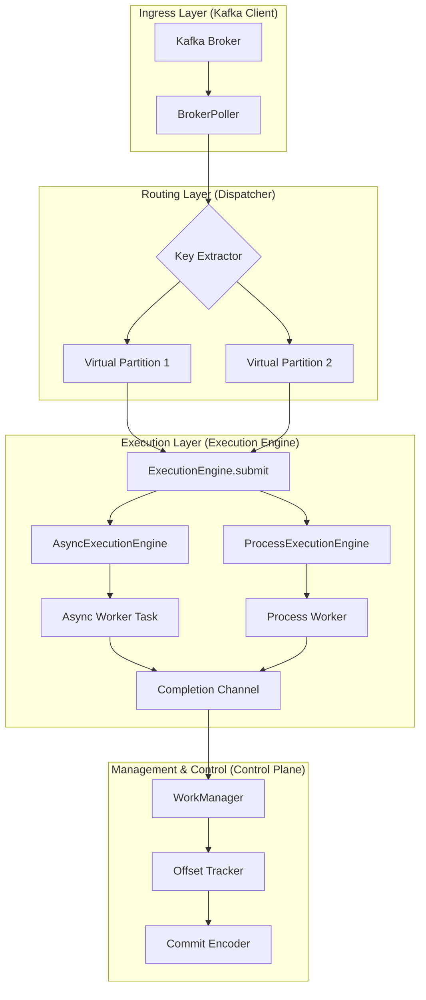

# Pyrallel Consumer

## 고성능 Kafka 병렬 처리 라이브러리

`Pyrallel Consumer`는 Java 생태계의 `confluentinc/parallel-consumer`에서 영감을 받아, Python `asyncio` 환경에 최적화된 고성능 Kafka 병렬 처리 라이브러리입니다. 메시지를 효율적으로 병렬 처리하면서도 데이터 정합성과 순서 보장을 최우선으로 설계되었습니다.

## 🌟 주요 특징

-   **병렬성 극대화**: Kafka 파티션 수에 얽매이지 않는 유연한 메시지 병렬 처리.
-   **정교한 순서 보장**: 메시지 키(Key) 기준으로 처리 순서를 유지하여 데이터 일관성 보장.
-   **데이터 정합성**: 리밸런싱 및 재시작 시 중복 처리를 최소화하는 '구멍(Gap) 기반 오프셋 커밋' 구현.
-   **안정성 및 가시성**: `Epoch-based Fencing`을 통한 리밸런싱 안정성 확보 및 상세 모니터링 지표 제공.
-   **유연한 실행 모델**: `AsyncExecutionEngine`과 `ProcessExecutionEngine` 중 런타임에 선택 가능한 하이브리드 아키텍처 제공.

## 📈 Observability

`KafkaConfig.metrics` 섹션을 통해 프로메테우스 지표를 노출할 수 있습니다. 기본값은 비활성화(`enabled=False`)이며, 아래와 같이 설정하면 `http://<host>:<port>/metrics`에서 Scrape 할 수 있습니다.

```python
from pyrallel_consumer.config import KafkaConfig

config = KafkaConfig()
config.metrics.enabled = True
config.metrics.port = 9095
consumer = PyrallelConsumer(config, worker, topic="demo")
```

### 노출되는 핵심 지표

| Metric | Type | Labels | 설명 |
| --- | --- | --- | --- |
| `consumer_processed_total` | Counter | `topic`, `partition`, `status` | 완료된 메시지 수 (성공/실패 구분) |
| `consumer_processing_latency_seconds` | Histogram | `topic`, `partition` | WorkManager 제출 → Completion 까지의 지연 |
| `consumer_in_flight_count` | Gauge | – | 현재 인플라이트 메시지 수 |
| `consumer_parallel_lag` | Gauge | `topic`, `partition` | True lag (`last_fetched - last_committed`) |
| `consumer_gap_count` | Gauge | `topic`, `partition` | 커밋을 막고 있는 Gap 수 |
| `consumer_internal_queue_depth` | Gauge | `topic`, `partition` | 가상 파티션 큐에 대기 중인 메시지 |
| `consumer_oldest_task_duration_seconds` | Gauge | `topic`, `partition` | Blocking offset이 막고 있는 시간 |
| `consumer_backpressure_active` | Gauge | – | Backpressure 동작 여부 (1=Pause) |
| `consumer_metadata_size_bytes` | Gauge | `topic` | Kafka 커밋 메타데이터 페이로드 크기 |

이 지표들은 `BrokerPoller.get_metrics()`와 동일한 값을 기반으로 생성되며, Grafana 대시보드 구성 시 그대로 사용할 수 있습니다.

## 🚀 아키텍처 개요

`Pyrallel Consumer`는 **Control Plane**, **Execution Plane**, **Worker Layer**로 명확하게 계층을 분리하여 설계되었습니다. `Control Plane`은 Kafka와의 통신 및 오프셋 관리를 담당하며, 어떤 `Execution Engine`이 사용되는지에 독립적으로 작동합니다. `Execution Plane`은 `Asyncio Task` 또는 `멀티프로세스`를 활용하여 사용자 정의 워커의 병렬 실행을 관리합니다.



## 🛠️ 설치 및 설정

### 의존성 관리: `uv`
프로젝트의 모든 의존성 설치 및 관리는 `uv` 툴을 사용합니다.
```bash
# uv 설치 (아직 설치되지 않았다면)
pip install uv

# 프로젝트 의존성 설치
uv pip install -r requirements.txt

# 개발 환경 의존성 설치 (선택 사항)
uv pip install -r dev-requirements.txt
```

### 설정: `pydantic-settings`
환경 변수 또는 `.env` 파일을 통해 Kafka 클라이언트 및 컨슈머 설정을 관리합니다. `KafkaConfig` 클래스(pyrallel_consumer/config.py 참조)를 통해 로드됩니다.

예시 `.env` 파일:
```dotenv
KAFKA_BOOTSTRAP_SERVERS=localhost:9092
KAFKA_CONSUMER_GROUP=my-consumer-group
PARALLEL_CONSUMER_EXECUTION_MODE=async # 또는 process
```

## 💡 사용법

(이 섹션에는 추후 간단한 코드 사용 예시가 추가될 예정입니다.)

## 🧪 벤치마크 실행

`benchmarks/run_parallel_benchmark.py` 스크립트는 프로듀서 → 베이스라인 컨슈머 → Pyrallel (async/process) 순서로 벤치마크를 자동 실행합니다. Kafka가 로컬에서 실행 중이라면 다음과 같이 사용할 수 있습니다.

```bash
uv run python benchmarks/run_parallel_benchmark.py \
  --bootstrap-servers localhost:9092 \
  --num-messages 50000 \
  --num-keys 200 \
  --num-partitions 8
```

- 콘솔에는 각 러운드별 TPS / 평균 / P99 지연이 표 형태로 출력됩니다.
- JSON 리포트는 기본적으로 `benchmarks/results/<UTC 타임스탬프>.json`에 저장됩니다.
- `--skip-baseline`, `--skip-async`, `--skip-process` 플래그를 통해 특정 라운드를 건너뛸 수 있습니다.
- 기본 동작으로 AdminClient를 사용해 벤치마크 토픽과 컨슈머 그룹을 삭제 후 재생성하여 이전 실행의 레그가 섞이지 않습니다. 클러스터 권한이 없거나 수동 제어가 필요한 경우 `--skip-reset` 플래그로 재설정을 비활성화할 수 있습니다.
- 워커가 느려질 때는 `--timeout-sec` 값(기본 60초)을 늘려 async/process 라운드의 타임아웃을 조정할 수 있습니다.

## 📖 문서

-   **`prd_dev.md`**: 개발자를 위한 요약 문서. 프로젝트의 주요 기능, 아키텍처, 개발 방법론 등을 간결하게 설명합니다.
-   **`prd.md`**: 상세 설계 해설서. 각 컴포넌트의 의도, 기술 선정 이유, 인터페이스 정의 등 "왜"라는 질문에 대한 깊이 있는 답변을 제공하는 문서입니다.

## 🤝 기여하기

모든 커밋 메시지는 [Conventional Commits](https://www.conventionalcommits.org/ko/v1.0.0/) 스펙을 따릅니다.

---
© 2026 Pyrallel Consumer Project
