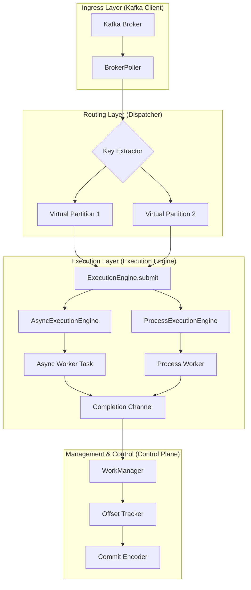

# Pyrallel Consumer

## 고성능 Kafka 병렬 처리 라이브러리

`Pyrallel Consumer`는 Java 생태계의 `confluentinc/parallel-consumer`에서 영감을 받아, Python `asyncio` 환경에 최적화된 고성능 Kafka 병렬 처리 라이브러리입니다. 메시지를 효율적으로 병렬 처리하면서도 데이터 정합성과 순서 보장을 최우선으로 설계되었습니다.

## 🌟 주요 특징

-   **병렬성 극대화**: Kafka 파티션 수에 얽매이지 않는 유연한 메시지 병렬 처리.
-   **정교한 순서 보장**: 메시지 키(Key) 기준으로 처리 순서를 유지하여 데이터 일관성 보장.
-   **데이터 정합성**: 리밸런싱 및 재시작 시 중복 처리를 최소화하는 '구멍(Gap) 기반 오프셋 커밋' 구현.
-   **안정성 및 가시성**: `Epoch-based Fencing`을 통한 리밸런싱 안정성 확보 및 상세 모니터링 지표 제공.
-   **유연한 실행 모델**: `AsyncExecutionEngine`과 `ProcessExecutionEngine` 중 런타임에 선택 가능한 하이브리드 아키텍처 제공.

## 📈 Observability

`KafkaConfig.metrics` 섹션을 통해 프로메테우스 지표를 노출할 수 있습니다. 기본값은 비활성화(`enabled=False`)이며, 아래와 같이 설정하면 `http://<host>:<port>/metrics`에서 Scrape 할 수 있습니다.

```python
from pyrallel_consumer.config import KafkaConfig

config = KafkaConfig()
config.metrics.enabled = True
config.metrics.port = 9095
consumer = PyrallelConsumer(config, worker, topic="demo")
```

### 노출되는 핵심 지표

| Metric | Type | Labels | 설명 |
| --- | --- | --- | --- |
| `consumer_processed_total` | Counter | `topic`, `partition`, `status` | 완료된 메시지 수 (성공/실패 구분) |
| `consumer_processing_latency_seconds` | Histogram | `topic`, `partition` | WorkManager 제출 → Completion 까지의 지연 |
| `consumer_in_flight_count` | Gauge | – | 현재 인플라이트 메시지 수 |
| `consumer_parallel_lag` | Gauge | `topic`, `partition` | True lag (`last_fetched - last_committed`) |
| `consumer_gap_count` | Gauge | `topic`, `partition` | 커밋을 막고 있는 Gap 수 |
| `consumer_internal_queue_depth` | Gauge | `topic`, `partition` | 가상 파티션 큐에 대기 중인 메시지 |
| `consumer_oldest_task_duration_seconds` | Gauge | `topic`, `partition` | Blocking offset이 막고 있는 시간 |
| `consumer_backpressure_active` | Gauge | – | Backpressure 동작 여부 (1=Pause) |
| `consumer_metadata_size_bytes` | Gauge | `topic` | Kafka 커밋 메타데이터 페이로드 크기 |

이 지표들은 `BrokerPoller.get_metrics()`와 동일한 값을 기반으로 생성되며, Grafana 대시보드 구성 시 그대로 사용할 수 있습니다.

## 📊 벤치마크 샘플 (프로파일 OFF)

최근 실행(4 partitions, 2000 msgs, 100 keys, profiling off)의 처리량(TPS)을 아래에 공유합니다. 워크로드는 `benchmarks/run_parallel_benchmark.py`의 `--workload` 옵션을 사용했습니다. 실행 시 프로파일링은 모두 비활성화했습니다.

| Workload | 설정 | baseline TPS | async TPS | process TPS |
| --- | --- | --- | --- | --- |
| sleep | `--workload sleep --worker-sleep-ms 5` | 159.69 | 2206.35 | 910.04 |
| cpu | `--workload cpu --worker-cpu-iterations 500` | 2598.79 | 1403.07 | 2072.26 |
| io | `--workload io --worker-io-sleep-ms 5` | 159.89 | 2797.18 | 916.60 |

> 주의: 프로세스 모드는 안정성을 위해 프로파일을 비활성화한 상태로 실행했습니다. 프로파일이 필요하면 baseline/async 위주로 사용하거나 별도 외부 프로파일러(py-spy 등)를 권장합니다.

## 🚀 아키텍처 개요

`Pyrallel Consumer`는 **Control Plane**, **Execution Plane**, **Worker Layer**로 명확하게 계층을 분리하여 설계되었습니다. `Control Plane`은 Kafka와의 통신 및 오프셋 관리를 담당하며, 어떤 `Execution Engine`이 사용되는지에 독립적으로 작동합니다. `Execution Plane`은 `Asyncio Task` 또는 `멀티프로세스`를 활용하여 사용자 정의 워커의 병렬 실행을 관리합니다.



## 🛠️ 설치 및 설정

### 의존성 관리: `uv`
프로젝트의 모든 의존성 설치 및 관리는 `uv` 툴을 사용합니다.
```bash
# uv 설치 (아직 설치되지 않았다면)
pip install uv

# 프로젝트 의존성 설치
uv pip install -r requirements.txt

# 개발 환경 의존성 설치 (선택 사항)
uv pip install -r dev-requirements.txt
```

### 패키지 설치/배포 (로컬 빌드)
```bash
# 로컬 설치 (editable 아님)
pip install .

# sdist/wheel 빌드
python -m pip install build
python -m build

# 생성물: dist/*.tar.gz, dist/*.whl
# 예시 업로드 (twine 사용 시)
# python -m pip install twine
# twine upload dist/*
```

### 보안/설정 메모
- Grafana(admin): `docker-compose.yml`는 `GF_SECURITY_ADMIN_PASSWORD`를 환경변수로 기대합니다. 실행 전 `.env`에 값을 넣으세요.
- DLQ: `KAFKA_DLQ_PAYLOAD_MODE`를 `metadata_only`로 설정하면 키/값 대신 헤더 메타데이터만 DLQ에 게시합니다. 기본값은 `full`(기존 동작 유지).
- 라이선스: Apache-2.0

### 설정: `pydantic-settings`
환경 변수 또는 `.env` 파일을 통해 Kafka 클라이언트 및 컨슈머 설정을 관리합니다. `KafkaConfig` 클래스(pyrallel_consumer/config.py 참조)를 통해 로드됩니다.

예시 `.env` 파일:
```dotenv
KAFKA_BOOTSTRAP_SERVERS=localhost:9092
KAFKA_CONSUMER_GROUP=my-consumer-group
EXECUTION_MODE=async # 또는 process
```

### 재시도 및 DLQ (Dead Letter Queue) 설정

Pyrallel Consumer는 실패한 메시지에 대한 자동 재시도와 DLQ 퍼블리싱을 지원합니다.

#### 재시도 설정 (`ExecutionConfig`)

재시도는 각 Execution Engine 내부에서 메시지별로 처리됩니다:

| 환경 변수 | 기본값 | 설명 |
| --- | --- | --- |
| `EXECUTION_MAX_RETRIES` | `3` | 최대 재시도 횟수 (실패 시 총 시도 횟수 = max_retries) |
| `EXECUTION_RETRY_BACKOFF_MS` | `1000` | 초기 백오프 지연 시간 (밀리초) |
| `EXECUTION_EXPONENTIAL_BACKOFF` | `true` | 지수 백오프 사용 여부 (`false`면 선형 백오프) |
| `EXECUTION_MAX_RETRY_BACKOFF_MS` | `30000` | 최대 백오프 상한선 (밀리초) |
| `EXECUTION_RETRY_JITTER_MS` | `200` | 백오프에 추가할 랜덤 지터 범위 (밀리초) |

백오프 계산 방식:
- **지수 백오프**: `min(retry_backoff_ms * 2^(attempt-1), max_retry_backoff_ms) + random(0, jitter_ms)`
- **선형 백오프**: `min(retry_backoff_ms * attempt, max_retry_backoff_ms) + random(0, jitter_ms)`

#### DLQ 설정 (`KafkaConfig`)

재시도를 모두 소진한 실패 메시지는 DLQ 토픽으로 퍼블리싱됩니다:

| 환경 변수 | 기본값 | 설명 |
| --- | --- | --- |
| `KAFKA_DLQ_ENABLED` | `true` | DLQ 퍼블리싱 활성화 여부 |
| `KAFKA_DLQ_TOPIC_SUFFIX` | `.dlq` | 원본 토픽 이름에 붙일 DLQ 토픽 접미사 |

DLQ 토픽으로 전송되는 메시지는 다음 헤더를 포함합니다:

| 헤더 키 | 설명 | 예시 |
| --- | --- | --- |
| `x-error-reason` | 최종 실패 에러 메시지 | `"ValueError: invalid data"` |
| `x-retry-attempt` | 최종 시도 횟수 | `"3"` |
| `source-topic` | 원본 토픽 이름 | `"orders"` |
| `partition` | 원본 파티션 번호 | `"2"` |
| `offset` | 원본 오프셋 | `"12345"` |
| `epoch` | 파티션 할당 에포크 (리밸런싱 추적용) | `"1"` |

**동작 흐름:**
1. 워커 함수 실행 실패 시 Execution Engine이 재시도
2. `max_retries` 도달 시 `CompletionEvent.status = FAILURE`, `attempt = max_retries`로 반환
3. `BrokerPoller`가 DLQ 퍼블리싱 실행 (활성화된 경우)
4. DLQ 퍼블리싱 성공 시에만 오프셋 커밋
5. DLQ 퍼블리싱 실패 시 오프셋 커밋 건너뛰고 에러 로깅

**예제:**

## 💡 사용법

### 재시도 & DLQ 설정 (요약)
- `KafkaConfig.dlq_enabled` (기본 `True`): 실패 메시지를 DLQ로 발행할지 여부
- `KafkaConfig.DLQ_TOPIC_SUFFIX` (기본 `.dlq`): DLQ 토픽 접미사 (`<원본토픽><접미사>`)
- `ExecutionConfig.max_retries` (기본 `3`): 워커 실행 재시도 횟수
- `ExecutionConfig.retry_backoff_ms` (기본 `1000`): 재시도 대기 시작값(ms)
- `ExecutionConfig.exponential_backoff` (기본 `True`): 지수 백오프 사용 여부
- `ExecutionConfig.max_retry_backoff_ms` (기본 `30000`), `retry_jitter_ms` (기본 `200`)
- 동작: 최대 재시도 후 실패 시 DLQ로 발행(`dlq_enabled=True`), DLQ 적재 성공 시에만 커밋

예시 `.env` (발췌)
```env
KAFKA_BOOTSTRAP_SERVERS=localhost:9092
KAFKA_CONSUMER_GROUP=my-consumer-group
EXECUTION_MODE=async              # async | process
EXECUTION_MAX_IN_FLIGHT=512
KAFKA_DLQ_ENABLED=true
KAFKA_DLQ_TOPIC_SUFFIX=.failed
METRICS_ENABLED=true
METRICS_PORT=9091
```

```python
from pyrallel_consumer.consumer import PyrallelConsumer
from pyrallel_consumer.config import KafkaConfig, ExecutionConfig
from pyrallel_consumer.dto import ExecutionMode, WorkItem

config = KafkaConfig()
config.dlq_enabled = True
config.DLQ_TOPIC_SUFFIX = ".failed"

exec_conf = ExecutionConfig()
exec_conf.mode = ExecutionMode.ASYNC
exec_conf.max_retries = 5
exec_conf.retry_backoff_ms = 2000

async def worker(item: WorkItem):
    ...

consumer = PyrallelConsumer(config=config, worker=worker, topic="orders")
```

### 🏁 빠른 시작 (선택) — DLQ 설정 포함 예제

1) 설치
```bash
pip install -r requirements.txt
```

2) 설정 + 워커 + 실행
```python
import asyncio
import hashlib
import time

from pyrallel_consumer.consumer import PyrallelConsumer
from pyrallel_consumer.config import KafkaConfig, ExecutionConfig
from pyrallel_consumer.dto import ExecutionMode, WorkItem

config = KafkaConfig(
    BOOTSTRAP_SERVERS=["localhost:9092"],
    CONSUMER_GROUP="demo-group",
    AUTO_OFFSET_RESET="earliest",
)
config.dlq_enabled = True
config.DLQ_TOPIC_SUFFIX = ".failed"

exec_conf = ExecutionConfig()
exec_conf.mode = ExecutionMode.ASYNC  # 또는 ExecutionMode.PROCESS
exec_conf.max_in_flight = 512
exec_conf.max_retries = 5
exec_conf.retry_backoff_ms = 2000

async def io_worker(item: WorkItem):
    _ = (item.payload or b"").decode("utf-8")
    await asyncio.sleep(0.005)

def cpu_worker(item: WorkItem):
    data = item.payload or b""
    for _ in range(500):
        data = hashlib.sha256(data).digest()

def sleep_worker(item: WorkItem):
    _ = (item.payload or b"").decode("utf-8")
    time.sleep(0.005)

consumer = PyrallelConsumer(
    config=config,
    worker=io_worker,  # 또는 cpu_worker / sleep_worker
    topic="demo-topic",
)

async def main():
    await consumer.start()
    try:
        await asyncio.sleep(60)
    finally:
        await consumer.stop()

asyncio.run(main())
```

3) 실행 엔진 선택 팁
- I/O 바운드: `ExecutionMode.ASYNC`, async 워커 사용
- CPU 바운드: `ExecutionMode.PROCESS`, picklable sync 워커 사용
- 동시 처리량: `max_in_flight`, `worker_pool_size`를 함께 조정

For detailed examples including async mode, process mode, configuration tuning, and graceful shutdown patterns, see the **[`examples/`](./examples/)** directory.

## 🧪 벤치마크 실행

`benchmarks/run_parallel_benchmark.py` 스크립트는 프로듀서 → 베이스라인 컨슈머 → Pyrallel (async/process) 순서로 벤치마크를 자동 실행합니다. Kafka가 로컬에서 실행 중이라면 다음과 같이 사용할 수 있습니다.

```bash
uv run python benchmarks/run_parallel_benchmark.py \
  --bootstrap-servers localhost:9092 \
  --num-messages 50000 \
  --num-keys 200 \
  --num-partitions 8
```

- 콘솔에는 각 러운드별 TPS / 평균 / P99 지연이 표 형태로 출력됩니다.
- JSON 리포트는 기본적으로 `benchmarks/results/<UTC 타임스탬프>.json`에 저장됩니다.
- `--skip-baseline`, `--skip-async`, `--skip-process` 플래그를 통해 특정 라운드를 건너뛸 수 있습니다.
- 기본 동작으로 AdminClient를 사용해 벤치마크 토픽과 컨슈머 그룹을 삭제 후 재생성하여 이전 실행의 레그가 섞이지 않습니다. 클러스터 권한이 없거나 수동 제어가 필요한 경우 `--skip-reset` 플래그로 재설정을 비활성화할 수 있습니다.
- 워커가 느려질 때는 `--timeout-sec` 값(기본 60초)을 늘려 async/process 라운드의 타임아웃을 조정할 수 있습니다.

## 📖 문서

-   **`prd_dev.md`**: 개발자를 위한 요약 문서. 프로젝트의 주요 기능, 아키텍처, 개발 방법론 등을 간결하게 설명합니다.
-   **`prd.md`**: 상세 설계 해설서. 각 컴포넌트의 의도, 기술 선정 이유, 인터페이스 정의 등 "왜"라는 질문에 대한 깊이 있는 답변을 제공하는 문서입니다.

## 📊 모니터링 스택 (Prometheus + Grafana)

- `docker-compose.yml`에 Prometheus(9090), Grafana(3000), Kafka Exporter(9308), Kafka UI(8080), Kafka(9092)가 포함됩니다.
- Prometheus 설정은 `monitoring/prometheus.yml`에서 관리하며 기본으로 `kafka-exporter`와 호스트의 Pyrallel Consumer(메트릭 포트 9091)를 스크랩합니다. 컨슈머가 컨테이너 내에서 돌면 해당 주소를 컨테이너 호스트네임으로 변경하세요.

사용 방법
1) 메트릭 활성화(애플리케이션):
```python
config.metrics.enabled = True
config.metrics.port = 9091
```

2) 스택 실행:
```bash
docker compose up -d
```

3) 확인:
- Prometheus: http://localhost:9090 (target 상태 확인)
- Grafana: http://localhost:3000 (기본 admin / admin)

4) Grafana 데이터소스 추가:
- Type: Prometheus
- URL: http://prometheus:9090
- Access: Server

5) 대시보드:
- Kafka Exporter 기본 지표 + Pyrallel Consumer `consumer_*` 메트릭을 선택하여 그래프 패널을 추가하면 됩니다.
- 예시 쿼리: `consumer_processed_total`, `consumer_processing_latency_seconds_bucket`, `consumer_in_flight_count`.

## 🤝 기여하기

모든 커밋 메시지는 [Conventional Commits](https://www.conventionalcommits.org/ko/v1.0.0/) 스펙을 따릅니다.

---
© 2026 Pyrallel Consumer Project
