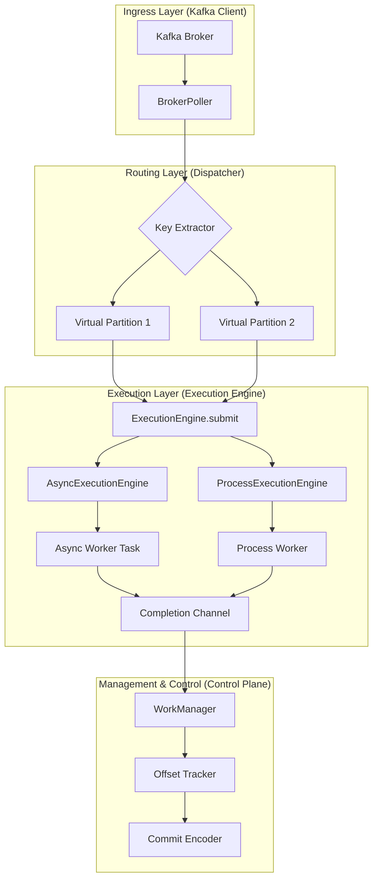

[English](./README.md) | [한국어](./README.ko.md)

# Pyrallel Consumer

## High-performance Kafka Parallel Processing Library

`Pyrallel Consumer` is a **Python Kafka parallel consumer** for high-throughput stream processing.
If you are looking for a **parallel consumer for Kafka in Python**, this project provides **key-ordered processing**, robust offset commit semantics, and runtime-selectable execution engines (`asyncio` / multiprocessing).

Inspired by Java's `confluentinc/parallel-consumer`, it is designed to maximize parallelism while preserving ordering guarantees and data consistency.

> **Release policy:** current published version is stable (`1.0.0`). `main` is the stable-release branch; prerelease lines remain opt-in preview channels.

## Support / Compatibility Policy

- **Python:** the current package metadata targets Python `>=3.12`, and the published classifiers currently advertise Python `3.12` and `3.13`.
- **Kafka:** the automated compatibility baseline currently covers the documented Python/client lanes on `confluentinc/cp-kafka:7.6.0` through broker-backed verification. Other broker distributions or older client/broker combinations remain best-effort. See [`docs/operations/compatibility-matrix.md`](./docs/operations/compatibility-matrix.md).
- **Release-line support:** the latest stable minor is the active support target, the previous stable minor is security-fix-only, and prerelease lines remain best-effort.
- **Policy detail:** see [`docs/operations/support-policy.md`](./docs/operations/support-policy.md).
- **Security reporting path:** see [`SECURITY.md`](./SECURITY.md).
- **Public contract freeze:** see [`docs/operations/public-contract-v1.md`](./docs/operations/public-contract-v1.md) for the v1-stable ordering / rebalance / DLQ / commit contract surface.
- **Upgrade/Rollback guide:** see [`docs/operations/upgrade-rollback-guide.md`](./docs/operations/upgrade-rollback-guide.md).
- **Release incident runbook:** see [`docs/operations/playbooks.md`](./docs/operations/playbooks.md).
- **Stable operations evidence reference:** see [`docs/operations/stable-operations-evidence.md`](./docs/operations/stable-operations-evidence.md).

## 🌟 Key Features

- **High parallelism**: Process messages in parallel without being tightly limited by Kafka partition count.
- **Ordering guarantees**: Preserve processing order per message key.
- **Data consistency**: Gap-based offset commit strategy to minimize duplicate processing during rebalances/restarts.
- **Stability & visibility**: Epoch-based fencing and rich operational metrics.
- **Flexible execution model**: Runtime-selectable hybrid architecture (`AsyncExecutionEngine` / `ProcessExecutionEngine`).

## 📈 Observability

`PyrallelConsumer` auto-wires `PrometheusMetricsExporter` when
`KafkaConfig.metrics.enabled=True`. When enabled, the facade starts the
Prometheus HTTP endpoint on `KafkaConfig.metrics.port`, forwards completion
metrics through `WorkManager`, and publishes gauge snapshots from
`BrokerPoller.get_metrics()` on a background task.

### Core Metrics

| Metric | Type | Labels | Description |
| --- | --- | --- | --- |
| `consumer_processed_total` | Counter | `topic`, `partition`, `status` | Number of completed messages (success/failure) |
| `consumer_processing_latency_seconds` | Histogram | `topic`, `partition` | End-to-end processing latency (WorkManager submit → completion) |
| `consumer_in_flight_count` | Gauge | – | Current in-flight message count |
| `consumer_parallel_lag` | Gauge | `topic`, `partition` | True lag (`last_fetched - last_committed`) |
| `consumer_gap_count` | Gauge | `topic`, `partition` | Number of commit-blocking gaps |
| `consumer_internal_queue_depth` | Gauge | `topic`, `partition` | Messages waiting in virtual partition queue |
| `consumer_oldest_task_duration_seconds` | Gauge | `topic`, `partition` | Time blocked by oldest offset/task |
| `consumer_backpressure_active` | Gauge | – | Backpressure status (1=paused) |
| `consumer_metadata_size_bytes` | Gauge | `topic` | Kafka commit metadata payload size |
| `consumer_resource_signal_status` | Gauge | `status` | Resource signal state as fixed one-hot labels: `available`, `unavailable`, `stale`, `first_sample_pending` |
| `consumer_resource_cpu_utilization_ratio` | Gauge | – | Latest resource-signal CPU utilization ratio, or `0` when fail-open |
| `consumer_resource_memory_utilization_ratio` | Gauge | – | Latest resource-signal memory utilization ratio, or `0` when fail-open |
| `consumer_process_batch_flush_count` | Gauge | `reason` | Process-mode batch flush count by `size`, `timer`, `close`, or `demand` |
| `consumer_process_batch_avg_size` | Gauge | – | Average process-mode batch size |
| `consumer_process_batch_last_size` | Gauge | – | Most recent process-mode batch size |
| `consumer_process_batch_last_wait_seconds` | Gauge | – | Wait time before the most recent process-mode batch flush |
| `consumer_process_batch_buffered_items` | Gauge | – | Items currently waiting in the process-mode batch buffer |
| `consumer_process_batch_buffered_age_seconds` | Gauge | – | Age of the current process-mode batch buffer |
| `consumer_process_batch_last_main_to_worker_ipc_seconds` | Gauge | – | Most recent main-to-worker IPC time |
| `consumer_process_batch_avg_main_to_worker_ipc_seconds` | Gauge | – | Average main-to-worker IPC time |
| `consumer_process_batch_last_worker_exec_seconds` | Gauge | – | Most recent worker execution time |
| `consumer_process_batch_avg_worker_exec_seconds` | Gauge | – | Average worker execution time |
| `consumer_process_batch_last_worker_to_main_ipc_seconds` | Gauge | – | Most recent worker-to-main IPC time |
| `consumer_process_batch_avg_worker_to_main_ipc_seconds` | Gauge | – | Average worker-to-main IPC time |

These metrics are based on the same values returned by `BrokerPoller.get_metrics()`.

### Runtime Snapshot API

For operator diagnostics outside Prometheus scraping, the facade also exposes
`PyrallelConsumer.get_runtime_snapshot()`. The snapshot is a read-only structured
projection of existing runtime state and includes:

- queue summary (`total_in_flight`, `total_queued`, live `max_in_flight`, configured ceiling, pause/rebalance state, ordering mode)
- retry policy snapshot (max retries and backoff settings)
- DLQ runtime status (enabled flag, topic, payload mode, message-cache usage)
- per-partition assignment/runtime state (epoch, committed/fetched offsets, gaps, blocking offset age, queue depth, in-flight count, minimum in-flight offset)

If `adaptive_concurrency.enabled=true`, `execution.max_in_flight` remains the
configured ceiling while `runtime_snapshot.queue.max_in_flight` reflects the
live control-plane limit after adaptive adjustments.

## 📊 Benchmark Snapshot (profiling OFF)

Recent run (4 partitions, 2000 messages, 100 keys, profiling off):

### Workload semantics (what each option actually does)

- `sleep` workload (`--worker-sleep-ms N`)
  - Simulates blocking latency by calling `time.sleep(N/1000)` per message.
  - Useful for modeling external blocking work with minimal CPU usage.

- `io` workload (`--worker-io-sleep-ms N`)
  - Simulates async I/O latency by awaiting `asyncio.sleep(N/1000)` per message.
  - Useful for network/DB-like I/O-bound behavior.

- `cpu` workload (`--worker-cpu-iterations K`)
  - Simulates CPU-bound work by repeatedly applying hash computation (`sha256`) `K` times per message.
  - Higher `K` means more CPU pressure per message.

These options are implemented in the benchmark workers and directly control per-message work cost.

| Workload | Setting | baseline TPS | async TPS | process TPS |
| --- | --- | --- | --- | --- |
| sleep | `--workloads sleep --order key_hash --worker-sleep-ms 5` | 159.69 | 2206.35 | 910.04 |
| cpu | `--workloads cpu --order key_hash --worker-cpu-iterations 500` | 2598.79 | 1403.07 | 2072.26 |
| io | `--workloads io --order key_hash --worker-io-sleep-ms 5` | 159.89 | 2797.18 | 916.60 |

> Note: process mode benchmarks were run with profiling disabled for stability.

## 🚀 Architecture Overview

`Pyrallel Consumer` is organized into three layers: **Control Plane**, **Execution Plane**, and **Worker Layer**.
The Control Plane manages Kafka communication and offsets independently from execution mode.
The Execution Plane runs user workers via `asyncio` tasks or multiprocessing.

The control plane talks to execution engines through the shared `BaseExecutionEngine`
contract. Process-specific commit clamping is exposed as an engine capability, so
`BrokerPoller` does not need concrete `ProcessExecutionEngine` type checks to stay safe.


```mermaid
graph TD
    subgraph "Ingress Layer (Kafka Client)"
        A["Kafka Broker"] --> B["BrokerPoller"]
    end

    subgraph "Routing Layer (Dispatcher)"
        B --> C{"Key Extractor"}
        C --> D["Virtual Partition 1"]
        C --> E["Virtual Partition 2"]
    end

    subgraph "Execution Layer (Execution Engine)"
        D --> G["ExecutionEngine.submit"]
        E --> G
        G --> H["AsyncExecutionEngine"]
        G --> I["ProcessExecutionEngine"]
        H --> J["Async Worker Task"]
        I --> K["Process Worker"]
        J & K --> L["Completion Channel"]
    end

    subgraph "Management & Control (Control Plane)"
        L --> M["WorkManager"]
        M --> N["Offset Tracker"]
        N --> O["Commit Encoder"]
    end
```

## 🛠️ Installation & Setup

### Dependency Management (`uv`)

```bash
pip install uv
uv sync
uv sync --group dev  # optional
```

### Package Build / Distribution

```bash
pip install .
python -m pip install build
python -m build
# artifacts: dist/*.tar.gz, dist/*.whl
```

### Security / Config Notes

- Grafana admin password is expected via `GF_SECURITY_ADMIN_PASSWORD` in `.env`.
- For DLQ payload minimization, set `KAFKA_DLQ_PAYLOAD_MODE=metadata_only`.
- Raw DLQ payload caching is bounded by `PARALLEL_CONSUMER_MESSAGE_CACHE_MAX_BYTES`
  (default `67108864`, about 64 MiB). When the cache budget is exhausted, the
  oldest raw payloads are evicted and DLQ publishing falls back to metadata-only
  payloads instead of holding unbounded memory.
- License: Apache-2.0

### Env-based Config (`pydantic-settings`)

Python constructor arguments and attributes use lowercase `snake_case`.
Environment variables remain uppercase `KAFKA_*` / `PARALLEL_CONSUMER_*`.

```dotenv
KAFKA_BOOTSTRAP_SERVERS=localhost:9092
KAFKA_CONSUMER_GROUP=my-consumer-group
PARALLEL_CONSUMER_EXECUTION__MODE=async  # or process
```

## 🔁 Retry & DLQ

Pyrallel Consumer supports automatic retries and DLQ publishing.

### Retry (`ExecutionConfig`)

| Env | Default | Description |
| --- | --- | --- |
| `EXECUTION_MAX_RETRIES` | `3` | Max retry count |
| `EXECUTION_RETRY_BACKOFF_MS` | `1000` | Initial backoff (ms) |
| `EXECUTION_EXPONENTIAL_BACKOFF` | `true` | Exponential backoff toggle |
| `EXECUTION_MAX_RETRY_BACKOFF_MS` | `30000` | Max backoff cap (ms) |
| `EXECUTION_RETRY_JITTER_MS` | `200` | Random jitter range (ms) |

### DLQ (`KafkaConfig`)

| Env | Default | Description |
| --- | --- | --- |
| `KAFKA_DLQ_ENABLED` | `true` | Enable DLQ publish |
| `KAFKA_DLQ_TOPIC_SUFFIX` | `.dlq` | DLQ topic suffix |
| `KAFKA_DLQ_PAYLOAD_MODE` | `full` | `full` preserves original key/value, `metadata_only` publishes headers only |
| `PARALLEL_CONSUMER_MESSAGE_CACHE_MAX_BYTES` | `67108864` | Max bytes reserved for raw DLQ payload cache before oldest entries are evicted |

DLQ headers include:
- `x-error-reason`
- `x-retry-attempt`
- `source-topic`
- `partition`
- `offset`
- `epoch`

When `KAFKA_DLQ_PAYLOAD_MODE=full`, the control plane keeps a bounded raw
message cache only for final DLQ publishing. If an entry is evicted before the
failure reaches DLQ, Pyrallel Consumer degrades to metadata-only DLQ publish
instead of retaining the offset indefinitely.

### Poison-message circuit breaker (`ParallelConsumerConfig`)

The poison-message circuit breaker is opt-in and scoped to `topic-partition + key`.
When enabled, repeated final failures for the same key open a cooldown window.
Queued messages for that key are force-completed as failures during the cooldown,
so they flow through the existing DLQ-or-skip completion path without another
worker execution attempt.

| Env | Default | Description |
| --- | --- | --- |
| `PARALLEL_CONSUMER_POISON_MESSAGE__ENABLED` | `false` | Enable keyed poison-message isolation |
| `PARALLEL_CONSUMER_POISON_MESSAGE__FAILURE_THRESHOLD` | `3` | Final failures for the same partition/key before opening the circuit |
| `PARALLEL_CONSUMER_POISON_MESSAGE__COOLDOWN_MS` | `30000` | Cooldown window for the open partition/key circuit |

## 💡 Usage

```python
from pyrallel_consumer.consumer import PyrallelConsumer
from pyrallel_consumer.config import KafkaConfig
from pyrallel_consumer.dto import ExecutionMode, WorkItem

config = KafkaConfig()
config.dlq_enabled = True
config.dlq_topic_suffix = ".failed"
config.metrics.enabled = True
config.metrics.port = 9091
config.parallel_consumer.ordering_mode = "key_hash"  # or "partition" / "unordered"
config.parallel_consumer.execution.mode = ExecutionMode.ASYNC
config.parallel_consumer.execution.max_retries = 5
config.parallel_consumer.execution.retry_backoff_ms = 2000
config.parallel_consumer.poison_message.enabled = True
config.parallel_consumer.poison_message.failure_threshold = 3
config.parallel_consumer.poison_message.cooldown_ms = 30000

async def worker(item: WorkItem):
    ...

consumer = PyrallelConsumer(config=config, worker=worker, topic="orders")

runtime_snapshot = consumer.get_runtime_snapshot()
# runtime_snapshot.queue.total_in_flight
# runtime_snapshot.partitions[0].blocking_offset
# runtime_snapshot.poison_message.open_circuit_count
```

Canonical Python config access uses lowercase snake_case attributes such as
`config.bootstrap_servers` and `config.dlq_topic_suffix`. Existing uppercase
attributes remain available as backward-compatible aliases, while environment
variables stay on the existing `KAFKA_*` / `PARALLEL_CONSUMER_*` names.

Ordering modes:
- `key_hash` (default): preserve order per message key while allowing parallelism across keys
- `partition`: preserve order per Kafka partition
- `unordered`: maximize throughput without ordering guarantees

`worker_pool_size` controls key-hash shard width for ordered routing. It does not
control process concurrency.

For process mode tuning, use
`config.parallel_consumer.execution.process_config.process_count` rather than
`worker_pool_size`.

Adaptive concurrency controls (opt-in):
- `adaptive_concurrency.enabled`: enables control-plane auto-tuning of the live `max_in_flight` limit.
- `adaptive_concurrency.min_in_flight`: lower guardrail for the live limit. `0` means "auto" and resolves to roughly 25% of the configured ceiling.
- `adaptive_concurrency.scale_up_step` / `scale_down_step`: how many slots to add or remove per adjustment.
- `adaptive_concurrency.cooldown_ms`: minimum wait between adjustments to avoid oscillation.

When adaptive concurrency is enabled, `execution.max_in_flight` stays the hard
ceiling. The control plane only adjusts the effective live limit reported by
`get_runtime_snapshot().queue.max_in_flight`; it does not reconfigure async
semaphores, process counts, or other engine-specific internals at runtime.

Shutdown policy controls:
- `shutdown_policy`: `graceful` (default) stops new fetches, waits for bounded drain, then escalates to cancellation / worker termination if the timeout expires. `abort` skips the drain window and goes straight to the forced-abort path.
- `consumer_task_stop_timeout_ms`: how long `BrokerPoller.stop()` waits for the consumer loop to exit after fetches are halted.
- `shutdown_drain_timeout_ms`: shared drain window before async task cancellation or process escalation. Async mode can still fine-tune its legacy path with `async_config.shutdown_grace_timeout_ms` when no shared override is set explicitly.
- `process_config.worker_join_timeout_ms`: additional process-mode join timeout after the shared drain window has elapsed.

For detailed runnable patterns, see [`examples/`](./examples/).

### Rebalance state preservation

- Default: `contiguous_only`
  - On rebalance/restart, only the safe contiguous HWM is preserved via the committed Kafka offset.
  - Sparse completed offsets beyond the HWM may be replayed later; this is the simplest and safest at-least-once default.
- Optional: `metadata_snapshot`
  - Sparse completed offsets are encoded into Kafka commit metadata on revoke/commit and restored on the next assignment.
  - This can reduce avoidable reprocessing, but failures must remain fail-closed back to `contiguous_only` semantics.

Even with `metadata_snapshot`, downstream side effects should remain idempotent.

## 🧪 Run Benchmarks

```bash
uv run python -m benchmarks.run_parallel_benchmark

# or pass flags directly for the existing CLI flow
uv run python benchmarks/run_parallel_benchmark.py \
  --bootstrap-servers localhost:9092 \
  --num-messages 50000 \
  --num-keys 200 \
  --num-partitions 8
```

- JSON report is saved to `benchmarks/results/<UTC timestamp>.json`.
- No flags: launches a Textual TUI so you can configure the benchmark interactively.
- You can skip rounds with `--skip-baseline`, `--skip-async`, `--skip-process`.
- Use `--workloads sleep,cpu` to run any subset of workloads and `--order key_hash,partition` to run multiple ordering modes in one invocation.
- Use `--strict-completion-monitor on,off` to compare the completion monitor modes in benchmark output.
- Use `--adaptive-concurrency off,on` to compare Pyrallel adaptive concurrency disabled vs enabled in the same benchmark matrix.
- Topic/group reset is enabled by default; disable with `--skip-reset` if needed.

## 🧪 Run E2E Tests

```bash
# Start local Kafka
docker compose up -d kafka-1

# Run Kafka-backed end-to-end tests
uv run pytest tests/e2e -q
```

- If Kafka is not available on `localhost:9092`, the E2E tests skip instead of failing immediately.
- Use the local `docker compose` stack when you want the full Kafka-backed path.
- The Kafka-backed ordering suite now exercises both `async` and `process` execution modes for `key_hash` and `partition` ordering on a real broker.
- The process-mode recovery suite now also covers retry, DLQ, rebalance during in-flight work, and restart/offset continuity on a real broker via `tests/e2e/test_process_recovery.py`.
- These tests prove broker-visible recovery invariants; longer-running soak and broader release-readiness concerns are still tracked separately.
- For the test monitoring stack, run `docker compose -f .github/e2e.compose.yml up -d`.
- Test-stack dashboards:
  - Prometheus: http://localhost:9090
  - Grafana: http://localhost:3000 (`local-e2e`)
- `kafka-exporter` may show `down` briefly during the first Kafka startup, but the compose stack restarts it automatically until Kafka is ready.
- To bring the `pyrallel-consumer` Prometheus target up, run either the benchmark/test harness (which now defaults to `--metrics-port 9091`) or any library consumer process with `config.metrics.enabled = True` and `config.metrics.port = 9091`.
- If no benchmark/test harness or library consumer process is actively exposing port `9091`, the `pyrallel-consumer` target staying `down` in Prometheus is expected.
- Example:
```bash
uv run python benchmarks/run_parallel_benchmark.py \
  --skip-baseline --skip-async \
  --workloads sleep --order partition \
  --num-messages 4000 \
  --worker-sleep-ms 0.02 \
  --metrics-port 9091
```

## 📖 Documentation

- [prd_dev.md](./prd_dev.md): canonical English entry for the developer-oriented PRD surface
- [prd.md](./prd.md): canonical English entry for the design-rationale PRD surface
- [prd_dev.ko.md](./prd_dev.ko.md): preserved Korean developer-spec source
- [prd.ko.md](./prd.ko.md): preserved Korean design-rationale source
- [docs/operations/language-policy.md](./docs/operations/language-policy.md): filename-language rule and explicit exemptions for internal/legacy docs
- [docs/internal-doc-language-policy.md](./docs/internal-doc-language-policy.md): legacy internal-doc entry that mirrors the same rule
- [docs/operations/playbooks.md](./docs/operations/playbooks.md): ops playbook, tuning guide, incident response

## 📊 Monitoring Stack (Prometheus + Grafana)

Included stack (via `docker-compose.yml`):
- Prometheus (9090)
- Grafana (3000)
- Kafka Exporter (9308)
- Kafka UI (8080)
- Kafka (9092)

Usage:

1) Current facade note:
- `config.metrics.enabled = True` makes `PyrallelConsumer` auto-start the
  Prometheus exporter on `config.metrics.port`.
- Use a port Prometheus can reach. In the test compose stack, `9091` is scraped
  as `host.docker.internal:9091`.

2) Start stack:
```bash
docker compose up -d
```

3) Verify:
- Prometheus: http://localhost:9090
- Grafana: http://localhost:3000 (`GF_SECURITY_ADMIN_PASSWORD` from `.env`)

4) Add Grafana datasource:
- Type: Prometheus
- URL: `http://prometheus:9090`
- Access: Server

5) Example queries:
- `consumer_processed_total`
- `consumer_processing_latency_seconds_bucket`
- `consumer_in_flight_count`
- `consumer_process_batch_flush_count{reason="timer"}`
- `consumer_process_batch_avg_size`
- `consumer_process_batch_last_size`
- `consumer_process_batch_last_wait_seconds`
- `consumer_process_batch_buffered_items`
- `consumer_process_batch_buffered_age_seconds`
- `consumer_process_batch_last_main_to_worker_ipc_seconds`
- `consumer_process_batch_avg_main_to_worker_ipc_seconds`
- `consumer_process_batch_last_worker_exec_seconds`
- `consumer_process_batch_avg_worker_exec_seconds`
- `consumer_process_batch_last_worker_to_main_ipc_seconds`
- `consumer_process_batch_avg_worker_to_main_ipc_seconds`

Interpretation and operator actions for these metrics live in:
- `docs/operations/guide.en.md`
- `docs/operations/guide.ko.md`

## 🤝 Contributing

All commit messages follow [Conventional Commits](https://www.conventionalcommits.org/en/v1.0.0/).

---
© 2026 Pyrallel Consumer Project
