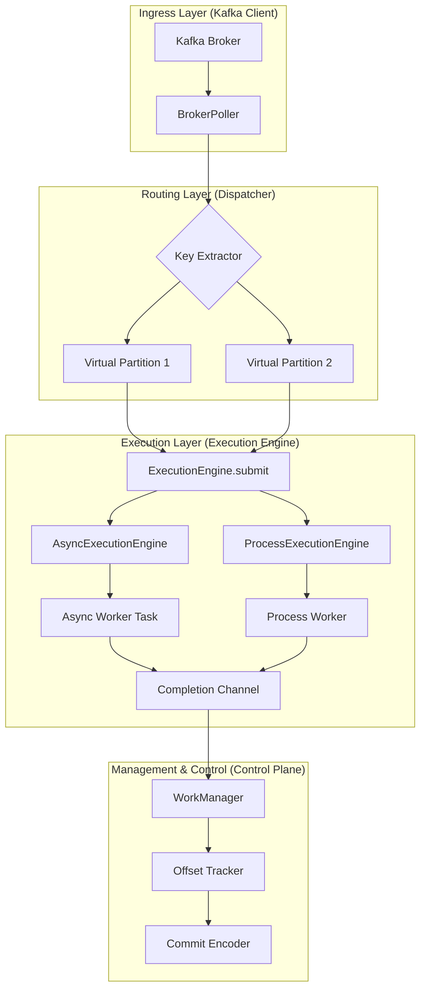

[English](./README.md) | [한국어](./README.ko.md)

# Pyrallel Consumer

## High-performance Kafka Parallel Processing Library

`Pyrallel Consumer` is a **Python Kafka parallel consumer** for high-throughput stream processing.
If you are looking for a **parallel consumer for Kafka in Python**, this project provides **key-ordered processing**, robust offset commit semantics, and runtime-selectable execution engines (`asyncio` / multiprocessing).

Inspired by Java's `confluentinc/parallel-consumer`, it is designed to maximize parallelism while preserving ordering guarantees and data consistency.

## 🌟 Key Features

- **High parallelism**: Process messages in parallel without being tightly limited by Kafka partition count.
- **Ordering guarantees**: Preserve processing order per message key.
- **Data consistency**: Gap-based offset commit strategy to minimize duplicate processing during rebalances/restarts.
- **Stability & visibility**: Epoch-based fencing and rich operational metrics.
- **Flexible execution model**: Runtime-selectable hybrid architecture (`AsyncExecutionEngine` / `ProcessExecutionEngine`).

## 📈 Observability

You can expose Prometheus metrics via `KafkaConfig.metrics`.
Metrics are disabled by default (`enabled=False`).

```python
from pyrallel_consumer.config import KafkaConfig

config = KafkaConfig()
config.metrics.enabled = True
config.metrics.port = 9095
consumer = PyrallelConsumer(config, worker, topic="demo")
```

### Core Metrics

| Metric | Type | Labels | Description |
| --- | --- | --- | --- |
| `consumer_processed_total` | Counter | `topic`, `partition`, `status` | Number of completed messages (success/failure) |
| `consumer_processing_latency_seconds` | Histogram | `topic`, `partition` | End-to-end processing latency (WorkManager submit → completion) |
| `consumer_in_flight_count` | Gauge | – | Current in-flight message count |
| `consumer_parallel_lag` | Gauge | `topic`, `partition` | True lag (`last_fetched - last_committed`) |
| `consumer_gap_count` | Gauge | `topic`, `partition` | Number of commit-blocking gaps |
| `consumer_internal_queue_depth` | Gauge | `topic`, `partition` | Messages waiting in virtual partition queue |
| `consumer_oldest_task_duration_seconds` | Gauge | `topic`, `partition` | Time blocked by oldest offset/task |
| `consumer_backpressure_active` | Gauge | – | Backpressure status (1=paused) |
| `consumer_metadata_size_bytes` | Gauge | `topic` | Kafka commit metadata payload size |

These metrics are based on the same values returned by `BrokerPoller.get_metrics()`.

## 📊 Benchmark Snapshot (profiling OFF)

Recent run (4 partitions, 2000 messages, 100 keys, profiling off):

| Workload | Setting | baseline TPS | async TPS | process TPS |
| --- | --- | --- | --- | --- |
| sleep | `--workload sleep --worker-sleep-ms 5` | 159.69 | 2206.35 | 910.04 |
| cpu | `--workload cpu --worker-cpu-iterations 500` | 2598.79 | 1403.07 | 2072.26 |
| io | `--workload io --worker-io-sleep-ms 5` | 159.89 | 2797.18 | 916.60 |

> Note: process mode benchmarks were run with profiling disabled for stability.

## 🚀 Architecture Overview

`Pyrallel Consumer` is organized into three layers: **Control Plane**, **Execution Plane**, and **Worker Layer**.
The Control Plane manages Kafka communication and offsets independently from execution mode.
The Execution Plane runs user workers via `asyncio` tasks or multiprocessing.


```mermaid
graph TD
    subgraph "Ingress Layer (Kafka Client)"
        A["Kafka Broker"] --> B["BrokerPoller"]
    end

    subgraph "Routing Layer (Dispatcher)"
        B --> C{"Key Extractor"}
        C --> D["Virtual Partition 1"]
        C --> E["Virtual Partition 2"]
    end

    subgraph "Execution Layer (Execution Engine)"
        D --> G["ExecutionEngine.submit"]
        E --> G
        G --> H["AsyncExecutionEngine"]
        G --> I["ProcessExecutionEngine"]
        H --> J["Async Worker Task"]
        I --> K["Process Worker"]
        J & K --> L["Completion Channel"]
    end

    subgraph "Management & Control (Control Plane)"
        L --> M["WorkManager"]
        M --> N["Offset Tracker"]
        N --> O["Commit Encoder"]
    end
```

## 🛠️ Installation & Setup

### Dependency Management (`uv`)

```bash
pip install uv
uv pip install -r requirements.txt
uv pip install -r dev-requirements.txt  # optional
```

### Package Build / Distribution

```bash
pip install .
python -m pip install build
python -m build
# artifacts: dist/*.tar.gz, dist/*.whl
```

### Security / Config Notes

- Grafana admin password is expected via `GF_SECURITY_ADMIN_PASSWORD` in `.env`.
- For DLQ payload minimization, set `KAFKA_DLQ_PAYLOAD_MODE=metadata_only`.
- License: Apache-2.0

### Env-based Config (`pydantic-settings`)

```dotenv
KAFKA_BOOTSTRAP_SERVERS=localhost:9092
KAFKA_CONSUMER_GROUP=my-consumer-group
EXECUTION_MODE=async # or process
```

## 🔁 Retry & DLQ

Pyrallel Consumer supports automatic retries and DLQ publishing.

### Retry (`ExecutionConfig`)

| Env | Default | Description |
| --- | --- | --- |
| `EXECUTION_MAX_RETRIES` | `3` | Max retry count |
| `EXECUTION_RETRY_BACKOFF_MS` | `1000` | Initial backoff (ms) |
| `EXECUTION_EXPONENTIAL_BACKOFF` | `true` | Exponential backoff toggle |
| `EXECUTION_MAX_RETRY_BACKOFF_MS` | `30000` | Max backoff cap (ms) |
| `EXECUTION_RETRY_JITTER_MS` | `200` | Random jitter range (ms) |

### DLQ (`KafkaConfig`)

| Env | Default | Description |
| --- | --- | --- |
| `KAFKA_DLQ_ENABLED` | `true` | Enable DLQ publish |
| `KAFKA_DLQ_TOPIC_SUFFIX` | `.dlq` | DLQ topic suffix |

DLQ headers include:
- `x-error-reason`
- `x-retry-attempt`
- `source-topic`
- `partition`
- `offset`
- `epoch`

## 💡 Usage

```python
from pyrallel_consumer.consumer import PyrallelConsumer
from pyrallel_consumer.config import KafkaConfig, ExecutionConfig
from pyrallel_consumer.dto import ExecutionMode, WorkItem

config = KafkaConfig()
config.dlq_enabled = True
config.DLQ_TOPIC_SUFFIX = ".failed"

exec_conf = ExecutionConfig()
exec_conf.mode = ExecutionMode.ASYNC
exec_conf.max_retries = 5
exec_conf.retry_backoff_ms = 2000

async def worker(item: WorkItem):
    ...

consumer = PyrallelConsumer(config=config, worker=worker, topic="orders")
```

For detailed runnable patterns, see [`examples/`](./examples/).

## 🧪 Run Benchmarks

```bash
uv run python benchmarks/run_parallel_benchmark.py \
  --bootstrap-servers localhost:9092 \
  --num-messages 50000 \
  --num-keys 200 \
  --num-partitions 8
```

- JSON report is saved to `benchmarks/results/<UTC timestamp>.json`.
- You can skip rounds with `--skip-baseline`, `--skip-async`, `--skip-process`.
- Topic/group reset is enabled by default; disable with `--skip-reset` if needed.

## 📖 Documentation

- `prd_dev.md`: concise developer-oriented summary
- `prd.md`: full design rationale and architecture details
- `docs/ops_playbooks.md`: ops playbook, tuning guide, incident response

## 📊 Monitoring Stack (Prometheus + Grafana)

Included stack (via `docker-compose.yml`):
- Prometheus (9090)
- Grafana (3000)
- Kafka Exporter (9308)
- Kafka UI (8080)
- Kafka (9092)

Usage:

1) Enable metrics in app:
```python
config.metrics.enabled = True
config.metrics.port = 9091
```

2) Start stack:
```bash
docker compose up -d
```

3) Verify:
- Prometheus: http://localhost:9090
- Grafana: http://localhost:3000 (default `admin` / `admin`)

4) Add Grafana datasource:
- Type: Prometheus
- URL: `http://prometheus:9090`
- Access: Server

5) Example queries:
- `consumer_processed_total`
- `consumer_processing_latency_seconds_bucket`
- `consumer_in_flight_count`

## 🤝 Contributing

All commit messages follow [Conventional Commits](https://www.conventionalcommits.org/en/v1.0.0/).

---
© 2026 Pyrallel Consumer Project
