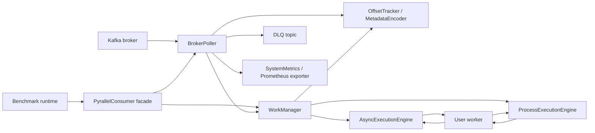
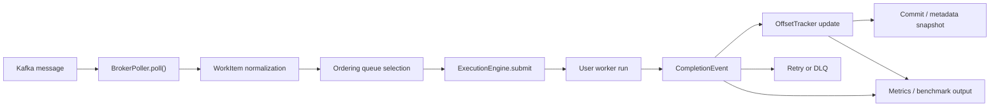

# Architecture

## 1. 문서 목적

이 문서는 `pyrallel-consumer`의 전체 아키텍처를 요약한다.
루트에서는 시스템 레이어와 핵심 흐름만 설명하고, worker contract, config key, metadata encoding detail은 feature 문서로 위임한다.

## 2. 전역 아키텍처 원칙

- `PyrallelConsumer`는 얇은 facade이고, 핵심 책임은 `BrokerPoller + WorkManager + OffsetTracker + ExecutionEngine` 조합에 있다.
- Control Plane은 execution mode에 대한 concrete type branching 없이 동작해야 한다.
- ordering과 offset correctness는 worker throughput보다 우선한다.
- rebalance는 예외 상황이 아니라 기본 설계 입력이다.
- metrics와 benchmark는 core runtime을 설명하는 보조 plane이지, core consume path 자체는 아니다.
- process mode의 추가 capability는 engine contract 또는 optional capability로 노출해야 한다.

## 3. 전체 시스템 구조

## 4. 현재 구조와 target-state 문서 구조의 관계

현재 코드 구조는 책임별로 아래처럼 나뉜다.

- core runtime: `pyrallel_consumer/consumer.py`
- control plane: `pyrallel_consumer/control_plane/*`
- execution plane: `pyrallel_consumer/execution_plane/*`
- observability: `pyrallel_consumer/metrics_exporter.py`, `docs/operations/guide.ko.md`, `docs/operations/playbooks.md`
- benchmark/tooling: `benchmarks/*`, `examples/*`

현재 코드 트리는 구현 파일 기준이고, 이 blueprint는 작업 단위 기준이다.

- `BrokerPoller`와 `WorkManager`는 서로 다른 파일이지만 `ingress`와 `reliability`라는 별도 작업 단위로 읽히도록 재배치한다.
- `OffsetTracker`와 `MetadataEncoder`는 현재 별도 파일이지만 commit-safe state라는 한 subfeature로 묶는다.
- benchmark와 observability는 현재 여러 README/ops 문서에 흩어져 있으므로 `04-tooling`으로 통합해 읽기 경로를 단순화한다.

## 5. feature와 레이어 대응

| 레이어 | 주요 feature |
| --- | --- |
| Kafka ingest facade/runtime | `01-ingress/01-kafka-runtime-ingest` |
| ordering-aware scheduler | `01-ingress/02-ordered-work-scheduling` |
| commit-safe state machine | `02-reliability/01-offset-commit-state` |
| rebalance / failure recovery | `02-reliability/02-rebalance-retry-dlq` |
| async execution engine | `03-execution/01-async-execution-engine` |
| process execution engine | `03-execution/02-process-execution-engine` |
| observability surface | `04-tooling/01-observability-metrics` |
| evaluation / profiling surface | `04-tooling/02-benchmark-runtime` |

## 6. 처리 흐름

1. `PyrallelConsumer`가 config와 worker를 받아 facade를 초기화한다.
2. `BrokerPoller`가 Kafka message를 poll하고 `WorkItem`으로 정규화한다.
3. `WorkManager`가 ordering mode에 따라 virtual queue와 runnable queue를 관리한다.
4. 선택된 execution engine이 worker를 실행하고 `CompletionEvent`를 되돌린다.
5. `OffsetTracker`가 HWM/gap state를 갱신하고, 필요 시 metadata snapshot을 계산한다.
6. 최종 실패는 retry exhaustion 이후 DLQ로 보낸다.
7. metrics/exporter와 benchmark runtime이 결과를 운영자에게 노출한다.

## 7. 저장소와 상태 역할

| 저장소/상태 | 역할 |
| --- | --- |
| Kafka source topic | canonical ingest source |
| Kafka committed offset | contiguous-safe progress의 authoritative state |
| Kafka commit metadata | sparse completed offset의 optional snapshot |
| in-memory virtual queues | ordering mode별 scheduling backlog |
| in-memory message cache | DLQ `full` payload mode를 위한 bounded raw payload cache |
| Prometheus registry / HTTP exporter | 운영자가 읽는 metrics projection |
| `benchmarks/results/*.json` | 성능 비교와 regression 해석용 결과물 |

## 8. 운영 경계

- 이 라이브러리는 at-least-once delivery를 전제로 하고, downstream side effect는 idempotent해야 한다.
- process mode의 isolation은 CPU-bound workload 대응을 위한 것이지 distributed exactly-once를 보장하는 수단은 아니다.
- `KafkaConfig.metrics`는 현재 `PyrallelConsumer` 퍼사드가 자동 wiring하는 runtime surface이고, compose/dashboard provisioning은 별도 운영 문서와 stack에서 다룬다.
- benchmark runtime은 개발/검증 도구이며, production runtime 경로에 직접 포함되지 않는다.

## 9. 읽기 안내

- facade와 Kafka poll loop: `features/01-ingress/01-kafka-runtime-ingest`
- ordering mode와 scheduling: `features/01-ingress/02-ordered-work-scheduling`
- HWM/gap/metadata snapshot: `features/02-reliability/01-offset-commit-state`
- rebalance/retry/DLQ: `features/02-reliability/02-rebalance-retry-dlq`
- async/process 엔진 차이: `features/03-execution`
- metrics와 benchmark surface: `features/04-tooling`
