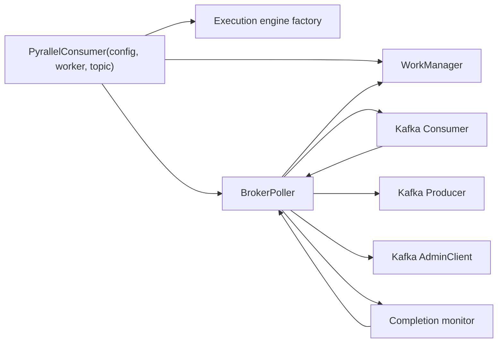

# Kafka Runtime Ingest Architecture

## 1. 문서 목적

이 문서는 `kafka-runtime-ingest`가 어떤 컴포넌트 조합으로 동작하는지 설명한다.
핵심은 facade bootstrap, Kafka client lifecycle, consume loop, completion monitor의 경계를 고정하는 것이다.

## 2. 주요 구성요소

| 구성요소 | 역할 |
| --- | --- |
| `PyrallelConsumer` | 사용자에게 노출되는 얇은 facade |
| `BrokerPoller` | Kafka poll, commit coordination, pause/resume, DLQ publish |
| Kafka `Consumer` | source topic poll과 rebalance callback 실행 |
| Kafka `Producer` | DLQ publish와 기타 write path |
| Kafka `AdminClient` | benchmark/reset 및 topic 관련 관리 보조 |
| `WorkManager` | ingest된 message를 ordering-aware queue로 전달 |
| Completion monitor | strict mode에서만 켜지는 broker-owned wake-up task로, completion drain과 commit/schedule 재개를 담당 |

## 3. 구조

## 4. 처리 흐름

1. `PyrallelConsumer`가 config와 worker를 받아 execution engine을 만든다.
2. 같은 config에서 ordering mode와 in-flight 제한을 읽어 `WorkManager`를 만든다.
3. `BrokerPoller`가 Kafka client를 초기화하고 consume loop를 시작한다.
4. poll된 message는 topic/partition/offset/key/value를 보존한 채 Control Plane 입력으로 넘어간다.
5. DLQ `full` mode가 켜져 있으면 raw payload를 bounded cache에 저장한다.
6. `strict_completion_monitor_enabled=true`면 completion monitor가 execution engine completion을 기다렸다가 commit/schedule 경로를 다시 깨운다.
7. `strict_completion_monitor_enabled=false`면 별도 task는 만들지 않지만, `BrokerPoller`는 consume cycle/shutdown drain 경로에서 completion을 계속 비워 correctness를 유지한다.
8. `PyrallelConsumer.get_runtime_snapshot()`은 poller/runtime support가 만든 read-only diagnostics를 그대로 노출하며, secure Kafka 설정값을 serialize하지 않는다.

## 5. 의존성과 경계

- `BrokerPoller`는 `BaseExecutionEngine`과 `WorkManager`를 사용하지만, async/process concrete class에 직접 의존하지 않는다.
- `WorkManager`는 ingest 이후 scheduling 단계부터 책임을 가진다.
- completion monitoring은 broker-owned lifecycle 옵션이며, `WorkManager`가 별도 watcher를 직접 소유하지는 않는다.
- raw payload cache는 `BrokerPoller` 내부 보조 상태이며, authoritative delivery state는 아니다.

## 6. 실패 경계

- invalid topic 이름은 runtime 시작 전에 차단한다.
- Kafka client 초기화 실패는 facade `start()` 실패로 surface 된다.
- consume loop 내부 fatal error는 `wait_closed()`를 통해 외부로 전달될 수 있어야 한다.
- payload cache 예산 초과는 warn 후 eviction으로 처리하고, 전체 runtime을 중단시키지 않는다.
