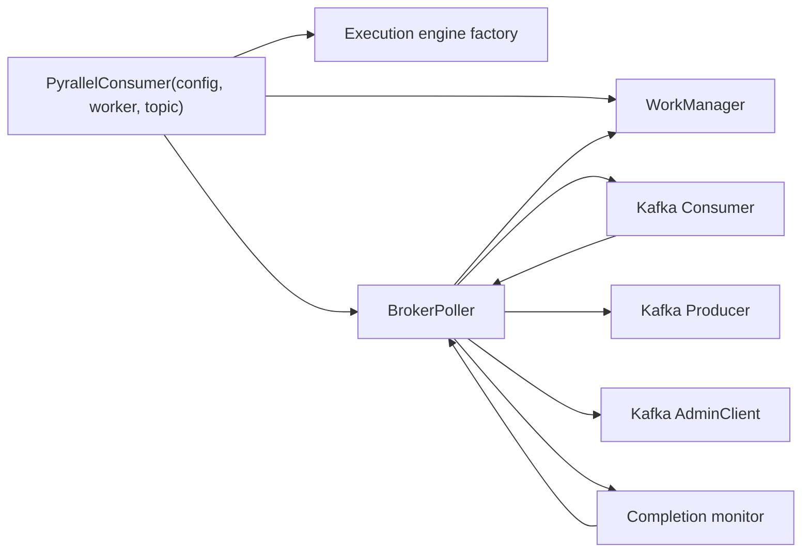

# Kafka Runtime Ingest Architecture

This document explains the component boundaries for the
`kafka-runtime-ingest` subfeature.
For the preserved Korean source text, see
[02-architecture.ko.md](./02-architecture.ko.md).

## 1. Document purpose

The goal of this subfeature is to keep bootstrap, Kafka client ownership,
consume-loop ownership, and completion-driven wakeups in stable places. The
current implementation anchor points are
`pyrallel_consumer.consumer.PyrallelConsumer`,
`pyrallel_consumer.control_plane.broker_poller.BrokerPoller`, and the broker
support modules under `pyrallel_consumer/control_plane/`.

## 2. Main components

| Component | Responsibility |
| --- | --- |
| `PyrallelConsumer` | Thin user-facing facade that assembles core components from config and worker input |
| `BrokerPoller` | Kafka poll loop, pause/resume control, commit coordination, DLQ publication, and lifecycle orchestration |
| Kafka `Consumer` | Polls the source topic and provides assignment or rebalance callbacks |
| Kafka `Producer` | Publishes terminal DLQ records and other write-side Kafka messages |
| Kafka `AdminClient` | Supports topic/admin operations needed by runtime and tooling surfaces |
| `WorkManager` | Receives normalized ingest work and applies ordering-aware scheduling |
| Completion monitor | Optional broker-owned task that waits on the execution engine, drains completions, and wakes commit or scheduling paths without waiting for the next poll timeout |

## 3. Structure

## 4. Processing flow

1. `PyrallelConsumer.__init__` stores config and topic, creates the execution
   engine through `create_execution_engine`, then constructs `WorkManager`, then
   constructs `BrokerPoller`.
2. `PyrallelConsumer.start()` acquires an optional metrics exporter and delegates
   runtime startup to `BrokerPoller.start()`.
3. `BrokerPoller.start()` validates topic-facing inputs, creates Kafka clients,
   starts the consume task, and conditionally starts the completion-monitor task
   when `strict_completion_monitor_enabled=true`.
4. The Kafka `Consumer` yields records into `BrokerPoller`, which preserves
   topic, partition, offset, key, and payload when preparing `WorkItem`
   submission.
5. If DLQ full payload mode is active, `BrokerPoller` stores the raw key/value
   pair in its bounded cache before downstream processing can discard it.
6. When enabled, the completion monitor waits on
   `BaseExecutionEngine.wait_for_completion()`, then drains completion events and
   triggers commit or scheduling work so head-of-line blocking can clear before
   the next idle poll cycle.
7. When strict completion monitoring is disabled, `BrokerPoller._run_consumer()`
   still drains completion events inline after consume cycles and during DLQ
   cadence work, so correctness stays the same but wakeups remain poll-driven.

## 5. Dependency boundaries

- `BrokerPoller` depends on `BaseExecutionEngine` and `WorkManager` contracts,
  not on async-specific or process-specific concrete engine classes.
- `WorkManager` owns ordering-aware scheduling after ingest; it does not own
  Kafka client setup or client lifecycle.
- Completion monitoring remains broker-owned lifecycle state. `WorkManager`
  exposes completion events, but it does not spawn or manage a background
  watcher of its own.
- Kafka client configuration is derived from `KafkaConfig` helper methods such
  as `get_consumer_config()`, `get_producer_config()`, and `get_admin_config()`.
- The raw payload cache is internal `BrokerPoller` state. It supports DLQ
  publication but is not the source of truth for commit progress.

## 6. Failure boundaries

- Topic validation failures must surface before the consume loop begins.
- Kafka client initialization failures surface as `PyrallelConsumer.start()`
  failures after facade cleanup.
- Fatal consume-loop errors are captured by the broker task lifecycle support
  and can be re-raised through `wait_closed()`.
- Cache budget exhaustion degrades by warning plus eviction, not by stopping the
  runtime.
