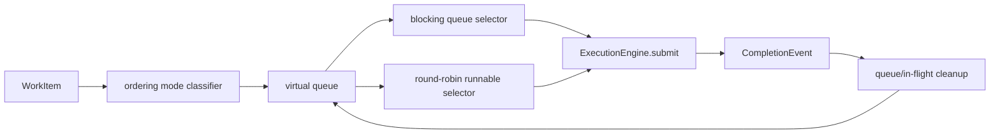

# Ordered Work Scheduling Architecture

## 1. 문서 목적

이 문서는 `WorkManager`가 어떤 자료구조와 정책으로 ordering-aware scheduling을 수행하는지 설명한다.

## 2. 주요 구성요소

| 구성요소 | 역할 |
| --- | --- |
| `virtual_partition_queues` | key 또는 partition 단위 backlog 보관 |
| `runnable_queue_keys` | 현재 실행 가능 후보 queue 목록 (`WorkQueueTopology`의 ordered-set helper가 순서를 유지) |
| `in_flight_work_items` | 실행 중인 canonical work item 추적 |
| `keys_in_flight` / `partitions_in_flight` | ordering mode별 동시 실행 fence |
| `OffsetTracker` | blocking gap 정보 제공 |

## 3. 구조

## 4. 핵심 흐름

1. ingest된 `WorkItem`은 ordering mode에 맞는 virtual queue에 들어간다.
2. queue head offset은 runnable 후보 집합에 등록된다.
3. 현재 gap을 막는 `blocking offset`이 있으면 해당 head queue를 우선 선택한다.
4. blocking 후보가 없으면 runnable queue를 round-robin으로 순회한다.
5. submit 후에는 ordering mode에 맞게 `keys_in_flight` 또는 `partitions_in_flight`에 fence를 건다.
6. completion이 도착하면 in-flight 상태를 지우고 다음 head를 다시 활성화한다.

현재 구현에서는 `deactivate_queue_key()`가 queue key 하나를 제거할 때 전체 deque를 재구성하지 않도록 `WorkQueueTopology` 내부 helper가 ordered-set 형태로 runnable key 순서를 관리한다. 이로써 queue 정리 경로는 여전히 FIFO/round-robin semantics를 유지하면서 hot-path rebuild 비용을 줄인다.

## 5. 경계

- `WorkManager`는 `submit` 전까지의 scheduling 책임만 가진다.
- 실제 worker retry/timeout/crash 처리 로직은 execution engine에 있다.
- gap 계산과 HWM 판단은 `OffsetTracker` 책임이고, `WorkManager`는 blocking hint만 소비한다.
- commit candidate 계산과 커밋 성공 후 state advance는 같은 contiguous-safe tracker API(`get_committable_high_water_mark()` / `commit_through()`)를 사용해 한 번만 계산되도록 유지한다.

## 6. 실패/복구 관점

- completion 없이 in-flight만 증가하는 경우 backpressure와 blocking duration 지표가 이상 징후를 드러내야 한다.
- rebalance 진입 시 새 submit을 멈추고 revoke grace 동안 기존 in-flight의 결과만 정리해야 한다.
- stale completion은 reliability 계층에서 epoch fence로 걸러지며, scheduler는 결과적으로 정상 completion만 반영한다고 가정한다.
