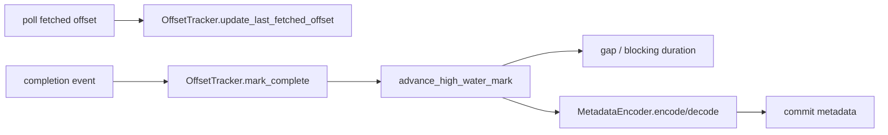

# Offset Commit State Architecture

## 1. 문서 목적

이 문서는 `OffsetTracker`와 `MetadataEncoder`가 함께 commit-safe state를 구성하는 방식을 설명한다.

## 2. 주요 구성요소

| 구성요소 | 역할 |
| --- | --- |
| `OffsetTracker` | partition별 completed/fetched state 관리 |
| `SortedSet completed_offsets` | sparse completion을 정렬 상태로 보관 |
| `MetadataEncoder` | sparse completion snapshot 압축/복원 |
| `PartitionMetrics` | gap/lag/blocking 상태의 projection |

## 3. 구조

## 4. 핵심 흐름

1. poll된 message는 `last_fetched_offset`를 전진시킨다.
2. completion이 오면 해당 offset을 `completed_offsets`에 추가한다.
3. `advance_high_water_mark()`가 contiguous run을 찾아 HWM을 전진시킨다.
4. HWM 뒤의 미완료 구간은 `gap`으로 남는다.
5. 필요한 경우 HWM 뒤의 sparse completed offset을 metadata에 encode 한다.
6. 재할당 시 metadata를 decode 해 초기 completed set으로 hydrate 할 수 있다.

## 5. 경계

- state machine은 partition 단위로 독립적이다.
- rebalance 타이밍 제어는 별도 subfeature에서 다루지만, 복원 가능한 snapshot 형식은 이 subfeature가 정의한다.
- 실제 commit 호출은 `BrokerPoller`가 담당하고, 여기서는 commit payload 계산 규칙만 다룬다.

## 6. failure 관점

- metadata decode 실패는 empty snapshot으로 degrade 되어야 한다.
- metadata budget을 넘기면 오래된 sparse completion부터 버려야 한다.
- snapshot이 손실돼도 contiguous committed offset만으로 재시작할 수 있어야 한다.
