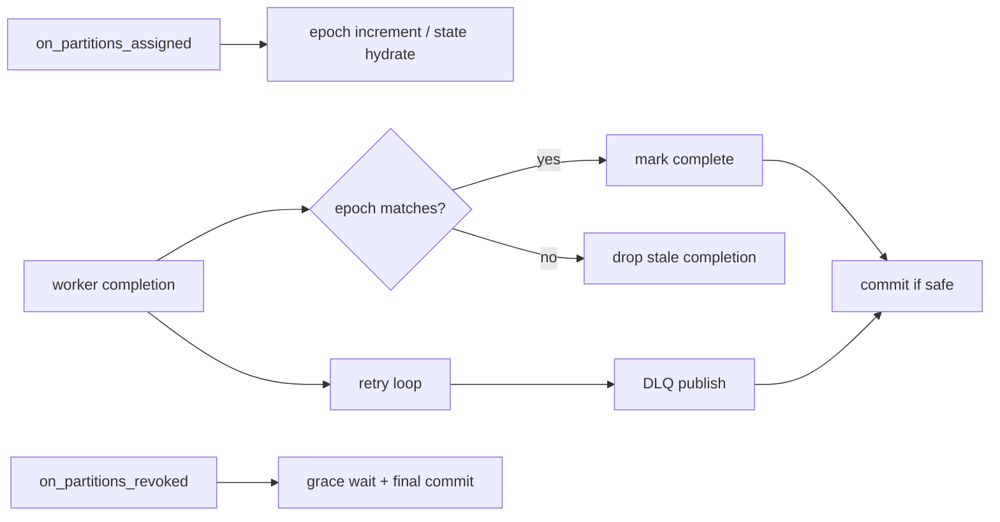

# Rebalance Retry DLQ Architecture

## 1. 문서 목적

이 문서는 리밸런스와 failure recovery가 어떤 흐름으로 이어지는지 설명한다.

## 2. 주요 구성요소

| 구성요소 | 역할 |
| --- | --- |
| partition epoch | partition ownership generation |
| assignment hydration | committed offset + metadata snapshot 복원 |
| revoke graceful commit | 마지막 contiguous-safe commit 시도 |
| execution retry loop | worker failure 재시도 |
| DLQ publisher | 최종 실패 payload publish |

## 3. 구조

## 4. 핵심 흐름

1. assignment 시 partition epoch를 증가시키고 기존 committed state를 hydrate 한다.
2. 모든 submitted `WorkItem`은 현재 epoch를 포함해 execution engine으로 들어간다.
3. completion이 돌아오면 현재 partition epoch와 비교한다.
4. epoch mismatch면 stale completion으로 버리고 offset state를 전진시키지 않는다.
5. worker failure는 engine 내부 retry/backoff를 거친다.
6. 최종 실패면 DLQ publish를 시도하고, DLQ 성공 시에만 commit-safe 경로로 넘어간다.
7. revoke 시에는 새 submit을 멈추고 grace timeout 안에서 마지막 commit을 시도한다.

## 5. 경계

- retry loop는 execution engine 내부이지만, 최종 failure의 commit/DLQ 의미는 Control Plane이 해석한다.
- assignment/revoke callback은 Kafka rebalance lifecycle 일부이며, scheduler와 offset state를 함께 조율한다.
- DLQ payload content는 ingest cache와 config에 의존하지만, commit correctness보다 우선하지 않는다.

## 6. 운영 관점

- revoke grace timeout이 짧으면 일부 sparse completion이 재처리될 수 있다.
- DLQ path가 깨지면 poison message가 commit을 붙잡을 수 있으므로 모니터링이 필요하다.
- epoch mismatch는 정상적인 rebalance 부산물일 수 있으며, 항상 버그를 뜻하지는 않는다.
