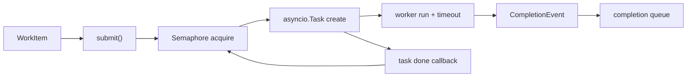

# Async Execution Engine Architecture

## 1. 문서 목적

이 문서는 `AsyncExecutionEngine`의 task lifecycle과 completion flow를 설명한다.

## 2. 주요 구성요소

| 구성요소 | 역할 |
| --- | --- |
| semaphore | 전체 async 동시 실행 제한 |
| `asyncio.Task` set | in-flight task registry |
| completion queue | `CompletionEvent` 전달 경로 |
| prefetched completion buffer | completion monitor를 위한 lookahead |
| shutdown event | 새 submit 차단과 종료 상태 표식 |

## 3. 구조

## 4. 핵심 흐름

1. `submit()`이 shutdown 상태를 확인하고 semaphore를 획득한다.
2. captured context 안에서 새 `asyncio.Task`를 만든다.
3. worker는 timeout/retry/backoff 규칙에 따라 실행된다.
4. 최종 결과는 `CompletionEvent`로 completion queue에 들어간다.
5. task done callback은 in-flight registry 정리와 semaphore release를 담당한다.
6. shutdown 시 grace timeout 동안 task completion을 기다리고, 남은 task는 취소한다.

## 5. 경계

- ordering과 commit progress는 Control Plane이 담당한다.
- async engine은 worker 실행 결과를 canonical completion으로만 표현한다.
- `get_in_flight_count()`는 현재 task 수만 알려 주며 scheduling source of truth는 아니다.
