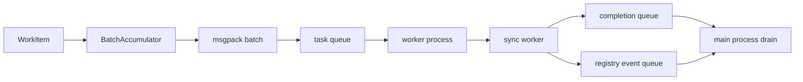

# Process Execution Engine Architecture

## 1. 문서 목적

이 문서는 `ProcessExecutionEngine`의 worker pool, IPC, batching, shutdown 흐름을 설명한다.

## 2. 주요 구성요소

| 구성요소 | 역할 |
| --- | --- |
| `ProcessExecutionEngine` | 메인 프로세스의 engine wrapper |
| `_BatchAccumulator` | `WorkItem`을 batch로 묶어 task queue에 flush |
| task queue | worker로 향하는 IPC |
| completion queue | worker 결과를 메인 프로세스로 전달 |
| registry event queue | start/timeout/crash 같은 보조 상태 전달 |
| worker process loop | 실제 sync worker 실행 |
| log queue | worker logging aggregation |

## 3. 구조

## 4. 핵심 흐름

1. `submit()`된 `WorkItem`은 batch accumulator에 모인다.
2. batch size 또는 wait timeout이 차면 msgpack payload로 직렬화되어 task queue로 간다.
3. worker process가 payload를 decode하고 각 item을 sync worker에 전달한다.
4. 성공/실패/timeout은 `CompletionEvent`로 직렬화되어 completion queue에 실린다.
5. worker lifecycle 보조 정보는 registry event queue를 통해 메인 프로세스로 전달된다.
6. shutdown 시 sentinel을 보내고 `join()`을 기다리며, straggler는 terminate 한다.

## 5. 경계

- process engine은 Kafka API를 직접 호출하지 않는다.
- batch는 worker 실행 효율을 위한 transport optimization이며 ordering/commit semantics를 바꾸지 않는다.
- `LogManager`는 worker 로그를 메인 프로세스 queue listener에 합치는 지원 계층이다.
