# Process Execution Engine Architecture

This document is the canonical English architecture summary for the
process-execution-engine subfeature. For the preserved Korean source text, see
[02-architecture.ko.md](./02-architecture.ko.md).

## Architectural comparison

The current compatibility path is:

```text
WorkManager virtual queues
  -> submit()
  -> shared multiprocessing.Queue
  -> workers compete on get()
  -> single completion queue
```

The target direction is:

```text
WorkManager virtual queues
  -> submit() / submit_batch()
  -> route identity resolution or RouteBatch lease
  -> worker-affine execution channel
  -> owner worker process
  -> item CompletionEvent or BatchCompletion envelope
  -> parent expansion to item completions
  -> single completion queue surface
```

## Architectural implications

- `WorkManager` stays responsible for ordering and eligibility.
- The process engine stays responsible for transport selection and dispatch.
- `shared_queue` remains the compatibility/default topology.
- `worker_pipes` is the worker-affine topology used to validate and evolve the
  long-term direction.
- Completion ownership remains parent-side and item-level. `worker_pipes` can
  use `BatchCompletion` as an internal IPC envelope, but parent polling still
  returns item-level completions and `batch_limit` remains item-count based.
- Ordered modes prefer affinity preservation, not stealing.
- Route-batch recovery, retry, and commit accounting remain item-level.

## Route-batch topology

The implemented route-batch topology is:

```mermaid
flowchart LR
    Poll["Kafka poll batch"]
    WM["WorkManager virtual queues"]
    Lease["same-route lease"]
    Engine["submit_batch(items)"]
    Pipe["worker_pipes route-batch payload"]
    Worker["worker sequential loop"]
    Done["BatchCompletion envelope"]
    Expand["parent expands CompletionEvent[]"]
    Commit["OffsetTracker / commit"]

    Poll --> WM --> Lease --> Engine --> Pipe --> Worker --> Done --> Expand --> Commit
```



The batch boundary is intentionally below the control plane. `WorkManager` still
chooses only safe-to-run items, and parent-side recovery still reasons about the
individual `WorkItem` identities inside the envelope.

## Evidence-backed rationale

Current benchmark and py-spy evidence suggest that ordered partition workloads
spend more time in shared-input receive paths such as
`_receive_task_payload -> multiprocessing.Queue.get -> synchronize.__enter__ -> connection.recv_bytes`
than in the actual worker function. That is why input dispatch topology is the
first architectural improvement target.
