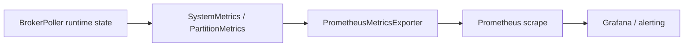

# Observability Metrics Architecture

## 1. 문서 목적

이 문서는 runtime state가 어떻게 metrics surface로 투영되는지 설명한다.

## 2. 주요 구성요소

| 구성요소 | 역할 |
| --- | --- |
| `BrokerPoller.get_metrics()` | runtime state를 `SystemMetrics`로 투영 |
| `PartitionMetrics` | partition별 lag/gap/blocking/queue 상태 |
| `PrometheusMetricsExporter` | Prometheus metric registration과 update |
| ops docs | alert/tuning/runbook 해석 레이어 |

## 3. 구조

## 4. 핵심 흐름

1. Control Plane이 current in-flight, pause state, partition lag/gap/queue 상태를 계산한다.
2. 이 상태는 `SystemMetrics`와 `PartitionMetrics`로 노출된다.
3. exporter는 system snapshot과 completion event를 Prometheus metric으로 업데이트한다.
4. 운영 문서는 이 metric을 lag/gap/backpressure/runbook 언어로 번역한다.

## 5. 경계

- metrics는 core runtime의 projection이지 source of truth 자체는 아니다.
- exporter 시작은 현재 `MetricsConfig.enabled`에 따른 helper 동작이며, facade가 자동으로 wiring 하지는 않는다.
- benchmark는 metrics와 연결될 수 있지만 별도 tooling subfeature에서 다룬다.
