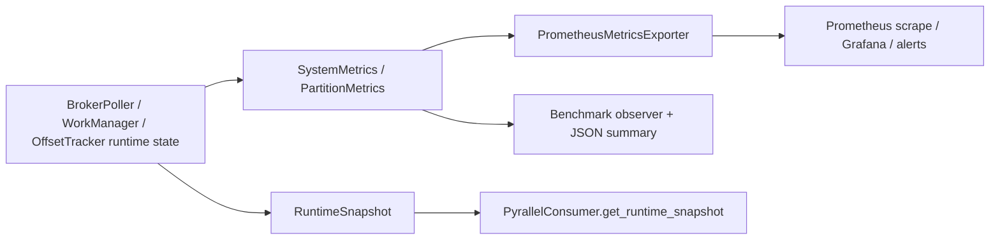

# Observability Metrics Architecture

This document explains how control-plane state is projected into metrics, runtime snapshots, and benchmark-observer summaries.
For the preserved Korean source text, see [02-architecture.ko.md](./02-architecture.ko.md).

## 1. Component boundaries

| Component | Current implementation | Responsibility |
| --- | --- | --- |
| Runtime metric projection | `BrokerPoller.get_metrics()` / `BrokerRuntimeSupport.get_system_metrics()` | project control-plane state into `SystemMetrics` / `PartitionMetrics` |
| Runtime snapshot projection | `BrokerRuntimeSupport.build_runtime_snapshot()` | build the read-only `RuntimeSnapshot` used by the public diagnostics facade |
| Public diagnostics facade | `PyrallelConsumer.get_runtime_snapshot()` | expose snapshot state to callers without requiring Prometheus scraping |
| Prometheus exporter | `PrometheusMetricsExporter` | register counters/gauges/histograms and translate `SystemMetrics` plus completion events into scrapeable signals |
| Benchmark observer | `benchmarks.pyrallel_consumer_test.BenchmarkMetricsObserver` | reuse `SystemMetrics`-derived lag/gap observations and optional exporter wiring during Pyrallel benchmark rounds |
| Operator interpretation layer | `docs/operations/guide.en.md`, `docs/operations/playbooks.md` | translate runtime telemetry into dashboards, alerts, and tuning/runbook actions |

## 2. Projection flow

## 3. Key flows

1. The control plane computes current in-flight, pause/rebalance, partition lag/gap, queue depth, and optional adaptive/process/resource-signal state.
2. `get_metrics()` projects that state into `SystemMetrics` / `PartitionMetrics` for exporter and benchmark observers.
3. `build_runtime_snapshot()` projects the same underlying state into a read-only diagnostics snapshot for direct caller inspection.
4. `PrometheusMetricsExporter` consumes `SystemMetrics`, completion durations, metadata size updates, and optional process/adaptive/resource-signal sections to update counters and gauges.
5. The benchmark harness may optionally publish exporter state for Pyrallel rounds and always records selected lag/gap observations into benchmark JSON summaries.
6. Operations docs interpret those surfaces for dashboards, alerts, and debugging guidance.

## 4. Adaptive/runtime-surface placement

- Adaptive backpressure and adaptive concurrency live in the control plane, but observability documents only their configured guardrails and effective live limits.
- The queue snapshot's `max_in_flight` value is the live control-plane limit; `configured_max_in_flight` is the static configured ceiling.
- Resource signals are advisory host snapshots. Their fixed-cardinality status gauges communicate availability/freshness without adding dynamic labels.
- Process-batch metrics are process-mode runtime projections only; they do not imply a separate scheduler contract.

## 5. Boundaries and invariants

- Metrics and runtime snapshots are projections of runtime state, not independent sources of truth.
- The public diagnostics facade remains read-only and must not mutate runtime behavior.
- Benchmark tooling may consume observability surfaces, but it must not redefine them or imply that benchmark JSON is the production observability contract.
- Baseline benchmark runs do not boot Pyrallel exporter state.
- Exporter startup is opt-in: production runtime uses `KafkaConfig.metrics.enabled`, while benchmark runtime uses `--metrics-port` only for Pyrallel rounds.
