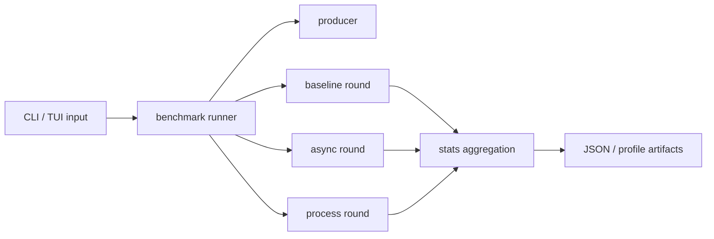

# Benchmark Runtime Architecture

## 1. 문서 목적

이 문서는 benchmark tooling이 어떤 컴포넌트로 구성되는지 설명한다.

## 2. 주요 구성요소

| 구성요소 | 역할 |
| --- | --- |
| `run_parallel_benchmark.py` | benchmark orchestration entrypoint |
| `producer.py` | 테스트 메시지 생성 |
| `baseline_consumer.py` | 비교 대상 baseline consumer |
| `pyrallel_consumer_test.py` | pyrallel mode 실행 |
| `stats.py` | TPS/latency 요약 계산 |
| `benchmarks/tui/*` | Textual 기반 interactive shell |

## 3. 구조

## 4. 핵심 흐름

1. CLI 또는 TUI가 benchmark 파라미터를 수집한다.
2. runner가 producer를 통해 테스트 메시지를 준비한다.
3. baseline, async, process 라운드를 순서대로 또는 선택적으로 실행한다.
4. 각 라운드의 처리량과 지연을 `stats.py`가 요약한다.
5. 결과는 콘솔 출력과 JSON artifact로 남는다.
6. profiling 옵션이 켜져 있으면 해당 모드에 맞는 profiler artifact를 추가로 만든다.

## 5. 경계

- benchmark tooling은 production runtime path 밖에 있다.
- CLI/TUI는 benchmark orchestration shell일 뿐 core runtime semantics를 바꾸지 않는다.
- reset helper와 profiling 도구는 환경 제약을 강하게 받으므로 best-effort support로 취급한다.
