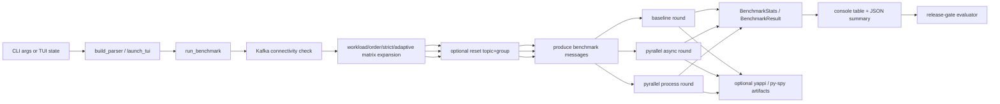

# Benchmark Runtime Architecture

This document explains how the benchmark runtime composes its runner, round helpers, stats pipeline, optional profiling hooks, and TUI surface.
For the preserved Korean source text, see [02-architecture.ko.md](./02-architecture.ko.md).

## 1. Component boundaries

| Component | Current implementation | Responsibility |
| --- | --- | --- |
| Benchmark entrypoint | `benchmarks/run_parallel_benchmark.py` | parses CLI args, launches the TUI when no args are provided, expands the benchmark matrix, orchestrates rounds, prints the summary table, and writes JSON output |
| Kafka connection check | `_check_kafka_connection()` | fails fast before the matrix starts if the configured broker cannot answer `list_topics()` |
| Reset helper | `benchmarks.kafka_admin.reset_topics_and_groups()` | best-effort delete/recreate of round topics plus consumer-group deletion before a round when reset is enabled |
| Producer helper | `benchmarks.producer.produce_messages()` | creates the topic lazily when asked, writes keyed benchmark messages, and prints producer-side throughput progress |
| Baseline round | `_run_baseline_round()` + `benchmarks.baseline_consumer.consume_messages()` | runs the single-process comparison consumer and returns a `BenchmarkResult` |
| Pyrallel rounds | `_run_pyrparallel_round()` + `benchmarks.pyrallel_consumer_test.run_pyrallel_consumer_test()` | configure async/process Pyrallel execution, optional metrics exposure, and completion tracking |
| Stats pipeline | `benchmarks.stats.BenchmarkStats` / `write_results_json()` | aggregates per-run throughput and latency and writes the JSON summary |
| Release-gate consumer | `benchmarks.release_gate.evaluate_release_gate()` | reads repeated benchmark JSON artifacts and converts them into machine-readable `PASS` / `NO-GO` release evidence |
| Profiling hooks | `_profile_session()` / `_relaunch_with_pyspy()` | wrap runs in yappi or py-spy when requested |
| Interactive shell | `benchmarks/tui/*` | collects the same options in a Textual UI and executes the benchmark as a subprocess-driven session |

## 2. Runtime flow

## 3. Topic and group lifecycle

1. `run_benchmark()` validates Kafka connectivity once before executing the matrix.
2. For each concrete run name/topic/group combination, the runner optionally calls `_reset_run_targets()`.
3. `_reset_run_targets()` delegates to `reset_topics_and_groups()`, which:
   - deletes the target topic if present,
   - deletes the target consumer group if present,
   - recreates the topic with the requested partition count.
4. If reset was executed, the subsequent producer/consumer helpers are told **not** to re-check topic existence (`ensure_topic_exists=False`) because the topic already exists.
5. If `--skip-reset` is enabled, the runner skips the admin reset path and instead relies on the producer/consumer helper path to lazily create the topic if it is missing.

This means topic validation/creation is a per-round execution concern, not a parse-time or TUI-form validation step.

## 4. Pyrallel-specific wiring

Pyrallel rounds add behavior that baseline rounds do not carry:

- `run_pyrallel_consumer_test()` builds a `KafkaConfig` for the selected execution mode.
- If `metrics_port` is not `None`, that config enables `KafkaConfig.metrics`, and the harness also acquires a cached `PrometheusMetricsExporter` for observer-side updates.
- Strict-completion-monitor and adaptive-concurrency flags are expanded as matrix axes and encoded into run names, topics, and consumer groups.
- Process-mode micro-batch overrides (`batch_size`, `max_batch_wait_ms`, `flush_policy`, `demand_flush_min_residence_ms`) are applied only to the benchmark harness configuration for that run.

## 5. Boundaries and invariants

- The benchmark runtime is an orchestration shell around existing producer/consumer helpers; it must not redefine production control-plane semantics.
- The TUI is a front-end for the same CLI contract, not a second benchmark API.
- The release-gate evaluator is a downstream consumer of benchmark artifacts, not part of the round-execution control flow.
- Metrics exposure is benchmark-process-scoped and optional; it is not evidence that every benchmarked code path auto-starts an exporter by itself.
- Profiling support is best-effort and intentionally separated from non-profiled performance comparison.
- Reset helpers and py-spy support depend on local environment permissions, broker readiness, and installed tooling.
