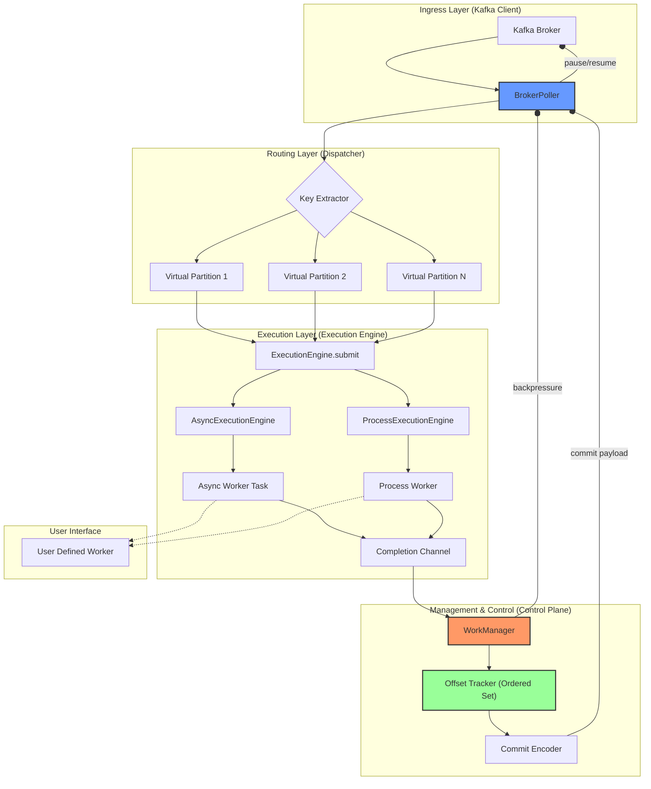

# Pyrallel Consumer – 최종 설계 해설서

이 문서는 `Pyrallel-Consumer`의 핵심 설계 결정에 대한 의도, 이유, 그리고 기술적 상세 내용을 담은 해설서입니다. `prd_dev.md`가 "무엇을"과 "어떻게"에 집중한다면, 이 문서는 "왜"에 대한 답변을 제공합니다.

## 1. 프로젝트 철학 및 목표

### 1.1. 설계 목표 (Design Goals)
- **Kafka Control Plane 단일화**: Async/Process 실행 모델에 관계없이 Kafka 소비, 리밸런싱, 오프셋 관리를 단일하게 처리합니다. 이는 복잡성을 한 곳에 모아 유지보수성을 높이기 위함입니다.
- **실행 모델 공존**: `AsyncExecutionEngine`과 `ProcessExecutionEngine`을 동일 릴리즈에 제공하며, 런타임 설정으로 선택 가능하게 합니다. 이는 I/O-bound 작업과 CPU-bound 작업 모두에 최적의 솔루션을 제공하기 위함입니다.
- **GIL 제약 회피**: `ProcessExecutionEngine`을 통해 Python GIL 제약을 구조적으로 회피하여 진정한 병렬 처리를 가능하게 합니다.
- **Execution Layer 확장 가능**: `ExecutionEngine` 인터페이스를 통해 새로운 실행 모델(예: Thread-based)의 추가를 지원하는 유연한 구조를 목표로 합니다.

### 1.2. 비목표 (Non-Goals)
- **Worker 구현 통합**: Async와 Process 워커의 구현 형태를 통일하지 않습니다. 이는 각 실행 모델의 장점을 극대화하고, 사용자에게 불필요한 제약을 주지 않기 위함입니다.
- **Execution Engine 내부 동작의 완전한 추상화**: 두 실행 엔진의 내부 동작 차이(IPC, Task 관리 등)를 완전히 숨기지 않고, 각 모델의 장단점과 제약사항을 명확히 드러냅니다. 이는 "새는 추상화(leaky abstraction)"를 피하기 위함입니다.
- **멀티 Consumer Process 분산**: 라이브러리 사용자 레벨에서의 다중 컨슈머 프로세스 실행은 지원하지만, 라이브러리 자체가 여러 노드에 걸쳐 분산되는 기능은 포함하지 않습니다.

### 1.3. 최종 설계 선언 (Architectural Statement)
> This system intentionally ships multiple execution models within the same release. Execution engines are runtime-selectable, but the control plane remains invariant. This design acknowledges Python’s execution constraints and provides explicit, safe boundaries instead of leaky abstractions.

이 선언은 프로젝트의 핵심 정체성을 나타냅니다. 우리는 Python의 한계를 인정하고, 이를 어설프게 숨기기보다 명확한 경계와 선택지를 제공하는 것을 목표로 합니다.

> This project treats execution models as interchangeable, but treats offset correctness as sacred.

실행 모델은 교체 가능한 부품이지만, 오프셋 정확성은 절대 타협할 수 없는 최우선 가치입니다.

## 2. 아키텍처

### 2.1. 레이어별 책임
| Layer             | 책임                                   |
| ----------------- | -------------------------------------- |
| **Control Plane** | Kafka 소비, 리밸런싱, 오프셋 관리, 상태 제어 |
| **Execution Plane** | 병렬 처리 로직 및 실행 모델 제공        |
| **Worker Layer**    | 사용자 비즈니스 로직 실행            |

### 2.2. 아키텍처 시각화


## 3. 핵심 인터페이스 및 데이터 계약

### 3.1. `ExecutionEngine` 인터페이스
모든 실행 엔진이 따라야 하는 추상 인터페이스로, DI(Dependency Injection)의 경계가 됩니다.
```python
from abc import ABC, abstractmethod
from typing import Any, AsyncIterator

class ExecutionEngine(ABC):
    @abstractmethod
    async def submit(self, record: Any, topic: str, partition: int, offset: int, epoch: int) -> None: ...
    @abstractmethod
    async def poll_completion(self) -> AsyncIterator[CompletionEvent]: ...
    @abstractmethod
    def in_flight(self) -> int: ...
    @abstractmethod
    async def shutdown(self) -> None: ...
```

### 3.2. 공통 DTO (Data Transfer Objects)
```python
from dataclasses import dataclass
from enum import Enum
from typing import Optional, Any

class CompletionStatus(Enum):
    SUCCESS = "success"
    FAILURE = "failure"

@dataclass(frozen=True)
class TopicPartition:
    topic: str
    partition: int

@dataclass(frozen=True)
class CompletionEvent:
    topic: str
    partition: int
    offset: int
    epoch: int
    status: CompletionStatus
    error: Optional[str]

@dataclass(frozen=True)
class ProcessTask:
    payload: Any
    topic: str
    partition: int
    offset: int
    epoch: int

@dataclass(frozen=True)
class OffsetRange:
    start: int
    end: int
```

## 4. Control Plane 상세 설계

### 4.1. `OffsetTracker`: 오프셋 관리 상태 머신

#### 4.1.1. 책임 재정의: 왜 단순한 Set이 아닌가?
`OffsetTracker`는 단순히 완료된 오프셋을 저장하는 객체가 아닙니다. **"커밋 가능한 최대 연속 오프셋(HWM)"과 "아직 메워지지 않은 구멍(Gap)"을 동시에 관리하는 상태 머신**입니다. 병렬 처리 환경에서는 메시지가 순서 없이 완료되므로, 단순히 완료된 오프셋만 기록해서는 안 되고, "어디까지 연속적으로 완료되었는지"를 추적해야만 안전한 커밋이 가능합니다.

#### 4.1.2. 불변 조건 (Invariants)
- HWM(High-Water Mark)은 단조 증가(Monotonically increasing)해야 합니다.
- HWM 이전의 오프셋은 재처리 대상이 되어서는 안 됩니다.
- 트래커에 남아있는 모든 오프셋은 HWM보다 커야 합니다.
- `mark_complete`는 순서와 관계없이(out-of-order) 호출될 수 있어야 합니다.

#### 4.1.3. 자료구조 선택 이유: 왜 `SortedSet`인가?
| 요구사항 | `SortedSet` | `Heap` | `Bitset` |
| :--- | :---: | :---: | :---: |
| 순서 보장 | ✅ | ✅ | ✅ |
| 최소값 접근 | **O(1)** | O(1) | O(N) |
| 삽입/삭제 | O(log N) | O(log N) | **O(1)** |
| Gap 계산 | **자연스러움** | ❌ (Pop 이후 상태 추적 어려움) | ❌ (Sparse gap에서 비효율) |

HWM을 계산하기 위해서는 "완료된 오프셋 중 가장 작은 값"에 빠르게 접근해야 합니다. Heap도 이 요구사항을 만족하지만, 연속성을 확인하기 위해 여러 번 `pop`해야 할 수 있고, 그 과정에서 상태를 되돌리기 어렵습니다. Bitset은 오프셋이 밀집되어 있을 때는 효율적이지만, 완료된 오프셋이 드문드문 존재하는(sparse) 경우 엄청난 메모리 낭비를 유발합니다. `SortedSet`은 모든 요구사항을 균형 있게 만족시키는 최적의 선택입니다.

#### 4.1.4. 핵심 알고리즘
- **`mark_complete(offset)`**: 완료 이벤트를 수신했을 때 호출됩니다.
    - **설계 의도**: 중복 호출을 허용하고, 리밸런스 이후에 뒤늦게 도착하는 이전 세대(stale)의 완료 이벤트를 안전하게 무시합니다. `offset <= self.last_committed_offset` 체크가 이 역할을 수행합니다.
- **`advance_high_water_mark()`**:
    - **함수의 의미**: "지금 당장 안전하게 커밋 가능한 최대 오프셋"을 계산합니다. Kafka에 오프셋을 커밋하기 직전에 항상 호출되어야 합니다. `completed_offsets`의 첫 번째 요소부터 시작하여 `last_committed_offset`과 연속되는지 확인하며 HWM을 최대한 전진시킵니다.

#### 4.1.5. 차단 감지 (Blocking Progress)
- **`is_blocking(offset)`**: `True`를 반환하는 오프셋은 현재 HWM의 진행을 막고 있는 "병목"입니다. `WorkManager`는 이 정보를 사용하여 해당 오프셋의 처리를 우선순위에 둡니다.

### 4.2. `Rebalance & Epoch Fencing`: 좀비(Zombie) 데이터 방지

#### 4.2.1. 문제 정의: 왜 Epoch Fencing이 필요한가?
Kafka Rebalance 시 발생하는 가장 위험한 문제는 **"소유권을 잃은 파티션의 작업 결과가 네트워크 지연 등으로 뒤늦게 도착하여, 새로운 소유자의 오프셋을 덮어쓰는 것"**입니다. 이를 "좀비 펜싱" 문제라고도 하며, 데이터 유실 또는 심각한 중복 처리를 유발합니다. `Epoch Fencing`은 이 문제를 설계적으로 불가능하게 만듭니다.

#### 4.2.2. 핵심 개념: `Partition Epoch`
- `Partition Epoch`는 "파티션 소유권의 세대 번호"입니다.
- 파티션이 컨슈머에 할당될 때마다 (`on_partitions_assigned`) 이 번호는 1씩 증가합니다.
- 모든 처리 작업은 `submit`될 때 당시의 `epoch`을 함께 전달받습니다.

#### 4.2.3. 핵심 방어 로직: 좀비를 식별하고 제거하기
작업 완료 이벤트가 `Completion` 채널을 통해 돌아왔을 때, `OffsetTracker`는 다음과 같은 검증을 수행합니다. 이것이 좀비를 막는 핵심입니다.
```python
def on_completion(event):
    state = partition_states.get(TopicPartition(event.topic, event.partition))

    # 1. 이미 소유권을 잃어 잊혀진 파티션인가?
    if state is None:
        return

    # 2. 이벤트의 epoch이 현재 파티션의 epoch과 일치하는가?
    if event.epoch != state.epoch:
        # STALE TASK! (좀비 발견)
        return  # 즉시 무시한다.

    # ... (정상 처리 로직)
    offset_tracker.mark_complete(event.offset)
```
**이 `event.epoch != state.epoch` 검증 한 줄이 이전 세대의 모든 지연된 결과를 안전하게 폐기하는 펜스(Fence) 역할을 합니다.**

#### 4.2.4. `Final Graceful Commit`: 유언 남기기
- **목적**: 파티션 소유권을 잃기 직전(`on_partitions_revoked`), "내가 여기까지는 확실히 처리했다"는 상태를 다음 소유자에게 최대한 정확하게 전달하는 것입니다.
- **절차**: `WorkManager`를 정지시키고, `OffsetTracker`의 현재 상태를 스냅샷하여 `Metadata Encoder`를 통해 압축한 후, 동기 방식(`commit_sync`)으로 커밋합니다.

### 4.3. `WorkManager`: 병목 해소 스케줄러

#### 4.3.1. 역할 재정의
`WorkManager`는 단순히 작업을 분배하는 디스패처가 아니라, **"전체 커밋 진행을 최대화하는 지능형 스케줄러"**입니다. 병렬 처리의 이점을 극대화하면서도, 병목으로 인해 전체 시스템이 멈추는 것을 방지하는 것이 핵심 역할입니다.

#### 4.3.2. 핵심 스케줄링 정책
- **Blocking Offset 우선 처리**: `OffsetTracker`로부터 `is_blocking(offset)`이 참인 오프셋 정보를 받아, 해당 오프셋이 포함된 파티션의 작업을 최우선으로 `ExecutionEngine`에 제출합니다. 이것이 처리되지 않으면 다른 모든 작업이 완료되어도 커밋이 불가능하기 때문입니다.
- **Starvation 방지**: Blocking 작업만 계속 처리하여 다른 파티션의 작업이 무기한 지연되는 것을 막기 위해, N회 연속 Blocking 작업을 처리했다면 강제로 일반 작업을 1회 실행하는 등의 정책을 사용합니다.

### 4.4. `Metadata Encoder`: 상태 압축 및 복원

#### 4.4.1. 존재 이유: 왜 메타데이터를 사용하는가?
Kafka의 오프셋 커밋 API는 오프셋과 함께 작은 크기(약 4KB)의 메타데이터를 저장할 수 있습니다. 우리는 이 공간을 활용하여 **"완료되었지만 아직 커밋되지 못한 오프셋"의 상태를 압축하여 저장**합니다. 컨슈머가 재시작하거나 리밸런싱이 발생했을 때, 이 메타데이터를 읽어 상태를 복원함으로써, 이미 완료된 작업을 불필요하게 재처리하는 것을 방지할 수 있습니다.

#### 4.4.2. 압축 전략: RLE vs Bitset
- **RLE (Run-Length Encoding)**: `[10, 11, 12, 15]` -> `"10-12,15"`. 연속된 오프셋이 많은 경우(밀집) 압축 효율이 좋습니다.
- **Bitset**: HWM을 기준으로 상대 위치를 비트로 표현합니다. 오프셋이 듬성듬성 분포한 경우(희소) 압축 효율이 좋습니다.
- **Simultaneous Encoder**: 두 방식으로 동시에 인코딩한 후, 더 짧은 결과물을 선택하여 공간을 최적으로 활용합니다.

#### 4.4.3. `Size Guard & Truncation`: 4KB 제한 준수
- 인코딩된 결과가 안전 한계(4000 바이트)를 초과할 경우, **가장 오래된(가장 작은) 오프셋 정보부터 제거**하여 크기를 맞춥니다.
- **이유**: 오래된 Gap은 이미 처리가 시작된 지 오래되어 재처리 비용이 상대적으로 낮다고 가정할 수 있습니다. 반면, 최신 Gap은 현재의 Blocking과 관련 있을 가능성이 높으므로 최대한 보존하는 것이 유리합니다.

### 4.5. `Backpressure`: 시스템 붕괴 방지

#### 4.5.1. 목적 재정의
Backpressure는 "처리 속도 조절"이 아니라, 시스템이 처리 능력을 초과하는 메시지를 받아들여 메모리 초과 등으로 **"시스템이 붕괴하는 것을 막는 최후의 안정성 장치"**입니다.

#### 4.5.2. 히스테리시스(Hysteresis) 제어
- **Pause 조건**: `Load >= max_in_flight * 1.0`
- **Resume 조건**: `Load <= max_in_flight * 0.7`
- `Pause`와 `Resume` 임계값을 다르게 두어, 시스템 부하가 임계값 근처에서 흔들릴 때 `pause`와 `resume`이 짧은 주기로 반복(Chattering)되는 현상을 방지합니다.

## 5. 관측성 (Observability) 설계: "진짜" Lag 측정하기

### 5.1. 관측 철학
병렬 처리 환경에서 Kafka의 기본 Lag(`LogEndOffset - CommittedOffset`)은 실제 지연 상태를 제대로 반영하지 못합니다. 우리가 진짜로 알아야 하는 것은 **"왜 커밋이 진행되지 않는가?"**와 **"어디가 병목인가?"** 입니다.

### 5.2. 핵심 관측 지표
- **`True Lag`**: `Log End Offset - Highest Contiguous Completed Offset (HWM)`. 실제로 아직 처리가 끝나지 않은 작업의 총량입니다. 이 지표가 증가하면 성능 저하, 정체되면 병목 발생을 의미합니다.
- **`Gap`**: `Completed Offsets - Committable Offsets`. 처리는 완료되었지만 앞선 작업이 끝나지 않아 커밋되지 못하고 대기 중인 작업의 양입니다. `Gap`의 증가는 특정 키/파티션에서 병목이 발생하고 있음을 시사합니다.
- **`Blocking Offset` & `Blocking Duration`**: HWM의 전진을 가로막고 있는 가장 낮은 오프셋과 그 지속 시간. 시스템 장애의 직접적인 원인을 가리킵니다.
