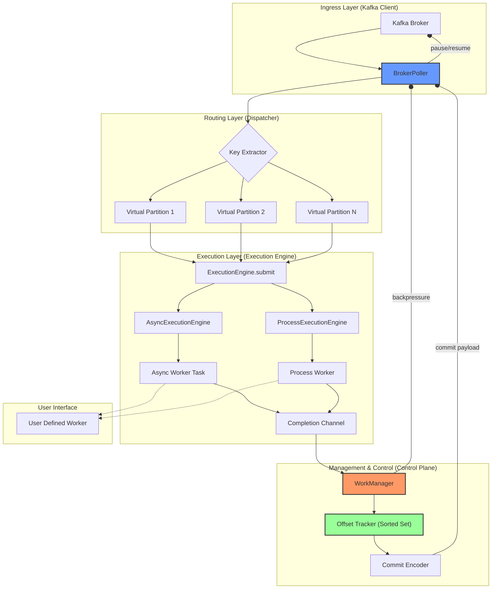
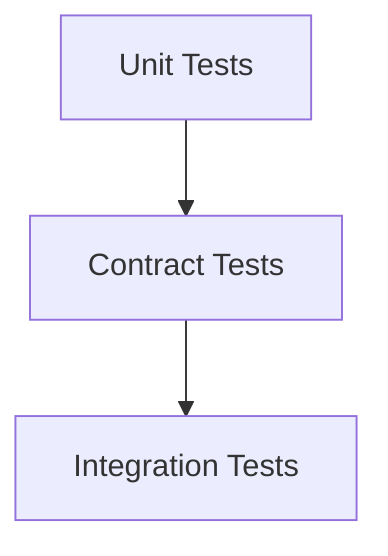

# Pyrallel Consumer: 개발 명세서 (prd_dev.md)

이 문서는 Python `asyncio` 환경에 최적화된 고성능 Kafka 병렬 처리 라이브러리 `Pyrallel-Consumer`의 기술 설계와 구현 지침을 담고 있습니다. `prd.md`의 내용을 개발자 관점에서 재구성하고 통합한 실무용 개발 문서입니다.

## 1. 프로젝트 목표 (Design Goals)

### 1.1. 핵심 목표
- **Kafka Control Plane 단일화**: 실행 모델(Async/Process)에 관계없이 Kafka 통신, 오프셋 관리, 리밸런싱 로직은 단일 코드로 유지합니다.
- **실행 모델 공존**: 단일 릴리즈 내에 `AsyncExecutionEngine`과 `ProcessExecutionEngine`을 모두 제공하며, 런타임 설정으로 선택 가능하게 합니다.
- **GIL 제약 회피**: `ProcessExecutionEngine`을 통해 CPU-bound 작업을 위한 구조적 해결책을 제공합니다.
- **확장성**: `ExecutionEngine` 인터페이스를 통해 새로운 실행 모델을 추가할 수 있는 구조를 갖습니다.

### 1.2. 비-목표 (Non-Goals)
- Worker 구현 통합: Async Worker와 Process Worker의 코드 형태(예: `async def` vs `callable`)를 통일하지 않습니다.
- 완전한 추상화: `ExecutionEngine`의 내부 동작 방식 차이를 완전히 숨기지 않고, 각 모델의 제약사항을 명확히 합니다.

### 1.3. 설계 철학
> This project treats execution models as interchangeable, but treats offset correctness as sacred.

> 이 프로젝트는 실행 모델을 교체 가능한 부품으로 취급하지만, 오프셋의 정확성은 신성불가침으로 다룹니다.

## 2. 전체 아키텍처

### 2.1. 레이어별 책임
| Layer             | 책임                                   |
| ----------------- | -------------------------------------- |
| **Control Plane** | Kafka 소비, 리밸런싱, 오프셋 관리, 상태 제어 |
| **Execution Plane** | 메시지의 병렬 처리, 실행 모델(Async/Process) 구현 |
| **Worker Layer**    | 사용자의 비즈니스 로직 실행            |

**핵심 원칙**: Control Plane은 현재 어떤 Execution Engine이 사용되는지 절대 인지하지 못해야 합니다.

### 2.2. 아키텍처 다이어그램


## 3. 핵심 컴포넌트 설계

### 3.1. 데이터 계약 (DTOs)

시스템의 각 레이어 간 통신은 아래의 DTO(Data Transfer Object)를 통해 이루어집니다.

```python
from dataclasses import dataclass
from enum import Enum
from typing import Optional, Any

# --- Completion ---
class CompletionStatus(Enum):
    SUCCESS = "success"
    FAILURE = "failure"

@dataclass(frozen=True)
class TopicPartition:
    topic: str
    partition: int

@dataclass(frozen=True)
class CompletionEvent:
    tp: TopicPartition
    offset: int
    epoch: int
    status: CompletionStatus
    error: Optional[str]

# --- Process Execution ---
@dataclass(frozen=True)
class ProcessTask:
    topic: str
    partition: int
    offsets: list[int]          # micro-batch offsets
    payload: bytes              # orjson.dumps(batch)
    epoch: int
    context: dict[str, str]     # tracing / logging

# --- Offset/Metadata Management ---
@dataclass(frozen=True)
class OffsetRange:
    start: int
    end: int
```

### 3.2. Execution Plane

#### 3.2.1. `ExecutionEngine` 인터페이스
모든 실행 엔진이 따라야 하는 계약입니다.

> **[⚠️ 경고]** `ExecutionEngine.submit()`은 내부 용량에 따라 블록될 수 있으므로, 제어 루프의 critical path에서 직접 호출해서는 안 됩니다. `WorkManager`가 용량 확인 후 호출해야 합니다.

```python
from abc import ABC, abstractmethod
from typing import Any, AsyncIterator

class ExecutionEngine(ABC):
    @abstractmethod
    async def submit(self, record: Any, tp: TopicPartition, offset: int, epoch: int) -> None:
        ...

    @abstractmethod
    async def poll_completion(self) -> AsyncIterator[CompletionEvent]:
        ...

    @abstractmethod
    def in_flight(self) -> int:
        # 참고용(metrics/debug) 카운터로만 사용해야 하며, Control Plane의 의사결정에 사용 금지
        ...

    @abstractmethod
    async def shutdown(self) -> None:
        ...
```

#### 3.2.2. `AsyncExecutionEngine`
- **실행 방식**: `asyncio.Task`를 생성하여 비동기 워커를 실행합니다.
- **Completion 전달**: `asyncio.Queue`를 사용하여 작업 완료/실패 이벤트를 Control Plane으로 전달합니다.
- **Worker 타입**: `async def`로 정의된 코루틴 함수여야 합니다.
- **동시성 제어**: `asyncio.Semaphore`를 사용하여 `max_in_flight`를 제한합니다.

#### 3.2.3. `ProcessExecutionEngine`
- **실행 방식**: `multiprocessing.Process`를 사용하여 별도의 프로세스에서 워커를 실행합니다.
- **IPC**: `multiprocessing.Queue` 두 개(task용, completion용)를 사용하여 Control Plane과 통신합니다.
- **Worker 타입**: Pickle 가능한 `callable`이어야 하며, 전역 상태나 Kafka API에 의존해서는 안 됩니다.
- **Micro-batching**: Pickle 비용 및 IPC 오버헤드를 줄이기 위해, Control Plane에서 Kafka 메시지를 마이크로 배치로 묶어 직렬화 후 워커 프로세스에 전달합니다. `ProcessExecutionEngine`은 CPU-bound 작업을 격리하는 데 중점을 둡니다.
- **`contextvars` 전파**: `multiprocessing` 환경에서는 `contextvars`가 자연스럽게 전파되지 않습니다. `ProcessTask` DTO에 로깅이나 추적에 필요한 컨텍스트 정보를 명시적으로 포함하고, 워커 프로세스에서 이를 다시 `contextvars`로 복원하여 일관된 로깅/추적 경험을 제공합니다.
- **에러 처리**: 워커 내부의 모든 예외는 `try/except`로 잡아 `CompletionStatus.FAILURE` 이벤트로 변환하여 전달합니다. 워커 프로세스의 비정상 종료(crash) 또한 감지하여 실패 이벤트로 처리합니다.
- **워커 래퍼 (`worker_loop`)**: 프로세스 내에서 실행되며, task 큐를 감시하다 작업을 받아 사용자 워커를 실행하고, 그 결과를 completion 큐에 넣는 역할을 합니다.
- **Shutdown**: `task_queue`에 Sentinel(`None`)을 넣어 워커 프로세스들의 정상 종료를 유도하고, `process.join()`으로 모든 자식 프로세스가 끝날 때까지 대기합니다.

### 3.3. Control Plane

#### 3.3.1. `OffsetTracker` (상태 머신)
- **책임**: "커밋 가능한 최대 연속 오프셋(HWM)"과 "아직 메워지지 않은 구멍(Gap)"을 관리하는 상태 머신입니다.
- **자료구조**: `sortedcontainers.SortedSet`을 사용하여 처리 완료된 오프셋들을 관리합니다. (순서 보장, 빠른 최소값 접근, 효율적인 삽입/삭제)
- **핵심 알고리즘**:
    - `mark_complete(offset)`: 완료된 오프셋을 `completed_offsets`에 추가합니다. 이미 커밋된 오프셋은 무시합니다.
    - `advance_high_water_mark()`: `completed_offsets`를 순회하며 `last_committed_offset`부터 연속된 오프셋이 어디까지 있는지 확인하고, HWM을 최대한 전진시킵니다.
- **Gap 계산**: `get_gaps()` 메서드는 HWM 이후에 완료되었지만, 연속되지 않아 커밋되지 못한 오프셋들의 구간(`OffsetRange`)을 계산하여 반환합니다.

#### 3.3.2. `WorkManager` (스케줄러)
- **책임**: "커밋 진행을 최대화하는 스케줄러"입니다. 단순히 작업을 분배하는 것을 넘어, 전체 처리량의 병목을 해소하는 데 집중합니다.
- **스케줄링 정책**:
    1.  **Blocking Offset 우선 처리**: 현재 HWM을 막고 있는 `blocking_offset` ( `last_committed_offset + 1` )이 있다면, 해당 오프셋이 포함된 파티션의 작업을 최우선으로 `ExecutionEngine`에 제출합니다.
    2.  **일반 스케줄링**: Blocking Offset이 없다면, Round-robin 등의 방식으로 다른 파티션에서 작업을 가져와 처리하여 워커가 쉬는 것을 방지합니다.
    3.  **Starvation 방지**: Blocking 작업만 계속 처리되어 다른 파티션의 작업이 무기한 지연되는 것을 막는 로직이 포함됩니다.

#### 3.3.3. `Metadata Encoder` (상태 스냅샷 압축기)
- **책임**: Kafka Offset Commit Metadata 필드(4KB 제한)에 "완료되었지만 아직 커밋되지 않은 오프셋"들의 상태를 압축하여 저장합니다. 이는 컨슈머 재시작 시 불필요한 중복 처리를 최소화하기 위함입니다.
- **압축 전략 (Simultaneous Encoding)**:
    - **RLE (Run-Length Encoding)**: `[10, 11, 12, 15]` -> `"10-12,15"`. 연속된 오프셋이 많을 때 효율적입니다.
    - **Bitset**: HWM을 기준으로 상대 위치를 비트로 표현합니다. 오프셋이 듬성듬성 분포할 때 효율적입니다.
    - 두 방식으로 동시에 인코딩한 후, 더 짧은 결과물을 선택합니다.
- **크기 제한 및 절단 (Size Guard & Truncation)**: 인코딩된 결과가 4000바이트를 초과하면, 가장 오래된(가장 작은) 오프셋 정보부터 제거하여 크기를 맞춥니다. 이는 재처리 비용이 가장 낮은 오래된 작업을 포기하는 전략입니다.

#### 3.3.4. Rebalance 와 Epoch Fencing
- **문제**: 리밸런싱으로 파티션 소유권을 잃은 컨슈머의 작업 결과가 뒤늦게 도착하여 잘못된 오프셋을 커밋하는 문제.
- **해결책 (Epoch Fencing)**:
    - **Epoch**: 파티션 소유권의 세대 번호. 리밸런싱이 발생하여 파티션을 새로 할당받을 때마다 1씩 증가합니다.
    - **상태 관리**: 모든 작업(`submit`)은 현재 파티션의 `epoch`을 달고 `ExecutionEngine`으로 보내집니다.
    - **방어 로직**: 작업 완료(`on_completion`) 시, 돌아온 이벤트의 `epoch`과 현재 파티션의 `epoch`을 비교합니다. 일치하지 않으면, 그 작업은 이전 세대의 "좀비" 작업으로 간주하고 결과를 즉시 폐기합니다.
- **리밸런스 콜백**:
    - `on_partitions_assigned`: 파티션에 대한 새 `epoch`을 생성하고, 이전 세션에서 남긴 Metadata를 읽어 `OffsetTracker` 상태를 복원(Hydration)한 후 처리를 시작합니다.
    - `on_partitions_revoked`: 진행 중인 작업 제출을 멈추고, 현재까지 완료된 작업에 대해 마지막으로 동기 커밋(Final Graceful Commit)을 시도하여 상태를 최대한 보존합니다. 이때, Kafka의 리밸런스 타임아웃 제약으로 인해 "정확성(Correctness)보다 생존성(Liveness)"을 우선하여, 설정된 시간(`max_revoke_grace_ms`) 내에 커밋이 완료되지 않으면 일부 미완료 오프셋에 대한 커밋을 포기할 수 있습니다.

#### 3.3.5. Backpressure (Pause/Resume)
- **책임**: 시스템이 처리 능력을 초과하는 메시지를 받아들여 붕괴하는 것을 막는 안정성 장치입니다.
- **제어 로직 (Hysteresis 적용)**:
    - **부하 지표 (`Load`)**: `in_flight_tasks + queued_tasks`
    - **Pause 조건**: `Load >= max_in_flight * 1.0` 일 때, `consumer.pause()`를 호출하여 더 이상 메시지를 가져오지 않습니다.
    - **Resume 조건**: `Load <= Resume_Threshold * 0.7` 일 때, `consumer.resume()`을 호출하여 다시 메시지를 가져옵니다.
    - 임계값을 두 개로 나누어, Pause와 Resume이 짧은 주기로 반복(chattering)되는 것을 방지합니다.

## 4. 설정 (Configuration)

`pydantic` 모델을 통해 관리될 설정 스키마 최종안입니다.

```yaml
parallel_consumer:
  execution:
    mode: "process"  # "async" | "process"
    max_in_flight_messages: 10000   # Control Plane 기준 전체 동시 처리량
    max_revoke_grace_ms: 500 # Rebalance graceful shutdown deadline

    async:
      max_concurrent_tasks: 500     # Engine 내부 안전장치 (Semaphore)
      task_timeout_ms: 30000

    process:
      process_count: 8 # os.cpu_count() 또는 유사한 기본값
      queue_size: 2048
      require_picklable_worker: true
      batch_size: 64 # Micro-batching: 메시지 개수
      batch_bytes: 256KB # Micro-batching: 배치 바이트 크기
      max_batch_wait_ms: 5 # Micro-batching: 최대 대기 시간

  commit:
    strategy: "on_complete" # "on_complete" | "periodic"
```
- `execution.mode`가 `"process"`일 때 워커가 코루틴이면 설정 오류를 발생시켜야 합니다.
- `max_in_flight_messages`는 `WorkManager`가 제어하는 시스템 전체의 동시성 한도이며, `async.max_concurrent_tasks`는 `AsyncExecutionEngine`의 내부 동시성 제한입니다.

## 5. 관측성 (Observability)

병렬 처리 환경에서 Kafka의 기본 `Lag (LogEndOffset - CommittedOffset)`은 더 이상 유의미하지 않습니다. 실제 시스템 상태를 반영하는 새로운 지표가 필요합니다.

- **`True Lag`**: `Log End Offset - Highest Contiguous Completed Offset (HWM)`. 실제로 아직 처리가 끝나지 않은 작업의 총량입니다.
- **`Gap`**: `Completed Offsets - Committable Offsets`. 처리는 완료되었지만 앞선 작업이 끝나지 않아 커밋되지 못하고 대기 중인 작업의 양. Gap의 증가는 특정 메시지/키에서 병목이 발생하고 있음을 의미합니다.
- **`Blocking Offset`**: HWM의 전진을 가로막고 있는 가장 낮은 오프셋. 시스템 병목의 "범인"입니다. 이 오프셋이 얼마나 오래 막혀있는지(`blocking_duration`)를 추적하는 것이 중요합니다.

### 권장 대시보드 구성
- **True Lag**: 실제 처리 지연 상태
- **Gap Size**: 병렬 처리의 비효율성/비용
- **Blocking Offset Top N**: 장애의 직접적인 원인
- **In-Flight / Capacity**: 시스템 과부하 여부
- **Pause State**: Backpressure 작동 상태

## 6. 테스트 전략 (TDD)

### 6.1. 테스트 피라미드


### 6.2. 핵심 테스트 항목

- **Control Plane (Mock Engine 사용)**: TDD 최우선 순위. 리밸런싱 중 오프셋 보존, Epoch 불일치 시 완료 이벤트 무시, Pause/Resume 조건 등을 테스트합니다.
- **ExecutionEngine Contract Tests**: `AsyncExecutionEngine`과 `ProcessExecutionEngine`이 모두 통과해야 하는 공통 테스트 스위트. `submit` -> `completion` 보장, 실패 이벤트 생성, `in_flight` 카운트 정확성 등을 검증하여 두 엔진의 교체 가능성을 보장합니다. **Control Plane이 `in_flight` 카운터에 의존하지 않고 독립적으로 동작하는지도 검증해야 합니다.**
- **Async/Process Engine-Specific Tests**:
    - **Async**: Task 취소, 타임아웃, 태스크 누수 없음.
    - **Process**: 워커 프로세스 Crash, SIGKILL 시그널, Pickle 불가 워커 전달 시 즉각 에러, 프로세스 누수 없음.

### 6.3. TDD 실행 순서
1.  **Phase 1 (Control Plane First)**: `ExecutionEngine`을 Mock으로 대체하고 `OffsetTracker`, `WorkManager` 등 Control Plane 로직을 먼저 TDD로 구현합니다.
2.  **Phase 2 (Contract Test 정의)**: `ExecutionEngine`의 공통 동작을 검증하는 테스트 스위트를 작성합니다.
3.  **Phase 3 (AsyncEngine 구현)**: `AsyncExecutionEngine`을 구현하고, Contract Test와 Async 전용 테스트를 통과시킵니다.
4.  **Phase 4 (ProcessEngine 구현)**: `ProcessExecutionEngine`을 구현하고, 동일한 Contract Test와 Process 전용 테스트를 통과시킵니다.

## 7. 작업 분해 및 실행 계획

### 7.1. 단계별 작업
- **Phase 1 – Control Plane (난이도: ★★★)**: Kafka 컨슈머 래퍼, `OffsetTracker` 구현.
- **Phase 2 – Execution Abstraction (난이도: ★★★★)**: `ExecutionEngine` 인터페이스 및 DTO 정의, 설정 기반 엔진 생성 팩토리 구현.
- **Phase 3 – AsyncExecutionEngine (난이도: ★★★)**: Task pool, Completion queue 구현.
- **Phase 4 – ProcessExecutionEngine (난이도: ★★★★★)**: IPC 채널, 워커 래퍼, Crash 핸들링 구현.

### 7.2. 실행 계획 Gantt 차트
```gantt
    title Parallel Consumer Execution Plan
    dateFormat  YYYY-MM-DD

    section Control Plane
    Consumer Loop        :a1, 2026-02-01, 7d
    Offset Tracker       :a2, after a1, 5d

    section Execution Abstraction
    Interface + DTO      :b1, after a1, 3d
    Factory              :b2, after b1, 2d

    section Async Engine
    Task Pool            :c1, after b1, 4d
    Completion Handling  :c2, after c1, 3d

    section Process Engine
    IPC Setup            :d1, after b1, 5d
    Crash Handling       :d2, after d1, 4d
```

## 8. 릴리즈 체크리스트 및 최종 선언

### 8.1. 릴리즈 체크리스트 (공존 기준)
- **기능**: Async/Process 엔진 런타임 선택 가능, Control Plane에 조건 분기 없음, CompletionEvent 단일 계약 유지.
- **안정성**: Rebalance 중 In-Flight 보호, Process Worker Crash 시 Consumer 중단 없음, Async Task 누수 없음.
- **문서 / UX**: Worker 제약 명시, 설정 Validation 에러 메시지 명확, Example 제공 (Async/Process 각각).

### 8.2. 최종 릴리즈 기준 (통합)
- **공존 조건**: Async/Process 엔진이 동일 릴리즈에 포함되고, `ExecutionEngine` Contract Test 100% 통과, Control Plane 코드에 `mode` 분기가 없어야 합니다.
- **안정성**: Worker Crash가 Consumer Crash로 이어지지 않으며, Rebalance 중 Offset 손실이 없어야 합니다.

### 8.3. 최종 설계 선언 (Architectural Statement)
> This system intentionally ships multiple execution models within the same release. Execution engines are runtime-selectable, but the control plane remains invariant. This design acknowledges Python’s execution constraints and provides explicit, safe boundaries instead of leaky abstractions.
